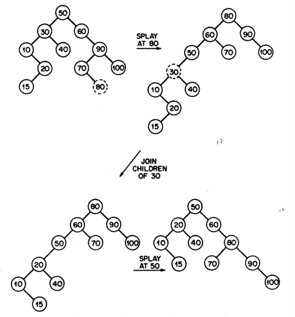
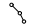
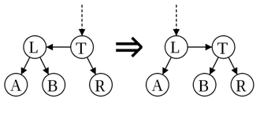
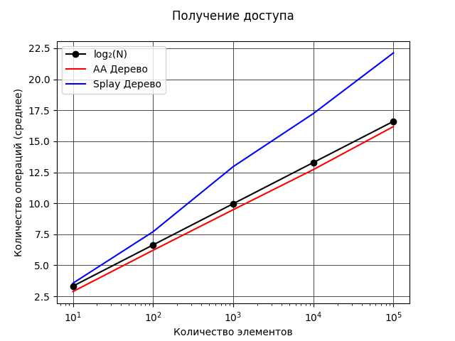

### МИНИСТЕРСТВО НАУКИ И ВЫСШЕГО ОБРАЗОВАНИЯ РОССИЙСКОЙ ФЕДЕРАЦИИ

### Федеральное государственное автономное образовательное учреждение высшего образования

## Дальневосточный федеральный университет
### ИНСТИТУТ МАТЕМАТИКИ И КОМПЬЮТЕРНЫХ ТЕХНОЛОГИЙ
### Департамент математического и компьютерного моделирования
### ДОКЛАД о практическом задании по дисциплине АИСД

# Сбалансированные деревья: Splay и AA

### Курпас Артём Викторович, гр. Б9121-09.03.03пикд

### г. Владивосток, 2022

# Содержание

[1. Введение](#1-введение)
[1.1. Неформальная постановка задачи](#11-неформальная-постановка-задачи)
[1.2. Математические методы](#12-математические-методы)

# Аннотация

В данном докладе рассматриваются формы бинарного дерева - **splay-деревья** и **AA-деревья**, описывается принцип работы и реализация этих структур данных. Исследованию и сравнению подлежит их производительность. 

# 1. Введение

По мере развития компьютерной сферы возникает необходимость в быстром и удобном хранилище данных, которое, в идеале, должно отвечать на все запросы быстро и хранить данные эффективно (с минимальными затратами памяти). Быстрее, чем в обычном массиве, данные можно хранить, например, используя бинарные деревья, сохраняя элементы по ключу.
Далее будут рассматриваться формы бинарного дерева поиска - **splay-деревья** и **АА-деревья**, которые принадлежат к классу так называемых **cбалансированных деревьев**. 

**Splay-дерево** было придумано Робертом Тарьяном и Даниелем Слейтером в 1983 году. 

**АA-дерево** было придумано Арне Андерссоном в 1993 году.

## 1.1. Неформальная постановка задачи
1. Необходимо осуществить реализацию алгоритмов как отдельные заголовочные файлы (.h)
2. Осуществить методы взаимодействия с ними - команды $access$, $insert$, $erase$.
3. Необходимо установить асимптотическую оценку для данных алгоритмов и определить, на каких задачах они будут максимально эффективными, в том числе, используя тесты с различным набором данных; определить соответствует ли время работы реализованного алгоритма теоритической оценке.

> Здесь и далее в документе под временем работы подразумевается асимптотическая оценка алгоритма.

## 1.2. Математические методы
При оценке эффективности **splay-дерева** используется метод так называемого *амортизационного анализа*. [Источник](https://neerc.ifmo.ru/wiki/index.php?title=%D0%90%D0%BC%D0%BE%D1%80%D1%82%D0%B8%D0%B7%D0%B0%D1%86%D0%B8%D0%BE%D0%BD%D0%BD%D1%8B%D0%B9_%D0%B0%D0%BD%D0%B0%D0%BB%D0%B8%D0%B7)

> *Определение:*
**Амортизационный анализ**  (англ.  _amortized analysis_) — метод подсчёта времени, требуемого для выполнения последовательности операций над структурой данных. При этом время усредняется по всем выполняемым операциям, и анализируется средняя производительность операций в худшем случае.

> *Определение:* 
**Средняя амортизационная стоимость операций** — величина $T'$, находящаяся по формуле: $T' = \frac{\sum_{i=1}^nt_i}{n}$ где $t$ — время выполнения операций 1, 2… $n$, совершённых над структурой данных.

> *Теорема (О методе потенциалов):*
Введём для каждого состояния структуры данных величину $Φ$ — потенциал. Изначально потенциал равен $Φ_0$, а после выполнения $i$-й операции — $Φ_i$. Стоимость $i$-й операции обозначим $a_i=t_i+Φ_i−Φ_i−1$. Пусть $n$ — количество операций, $m$ — размер структуры данных. Тогда средняя амортизационная стоимость операций $a=O(f(n,m))$, если выполнены два условия:
    - Для любого $i:a_i=O(f(n,m))$
    - Для любого $i:Φ_i=O(n⋅f(n,m))$

### Оценка эффективности $splay(x)$

[Источник](https://neerc.ifmo.ru/wiki/index.php?title=Splay-%D0%B4%D0%B5%D1%80%D0%B5%D0%B2%D0%BE)

Для оценки эффективности $splay$ будет использоваться метод потенциалов. Потенциалом рассматриваемого дерева назовём сумму рангов его вершин. Ранг вершины $x$ — это величина, обозначаемая $r(x)$ и равная $log_2C(x)$, где $C(x)$ — количество вершин в поддереве с корнем в $x$.

> *Лемма*
Амортизированное время операции $splay$ вершины $x$ в дереве с корнем $t$ не превосходит $1+3(r(t)−r(x))$
$$T'(splay(x)) \leqslant 1+3(r(t)−r(x))$$

> *Доказательство*

Проанализируем каждый шаг операции splay. Пусть $r'$ и $r$ — ранги вершин после шага и до него соответственно, $p$ — предок вершины $x$, а $g$ — предок $p$.

Разберём случаи в зависимости от типа шага:

$zig(x)$. Поскольку выполнен один поворот, то амортизированное время выполнения шага $T'=1+r'(x)+r'(p)−r(x)−r(p)$ (поскольку только у вершин $x$ и $p$ меняется ранг). Ранг вершины $p$ уменьшился, поэтому $r'(p)−r(p)⩽0$. Ранг вершины $x$ увеличился, поэтому $r'(x)−r(x)⩾0$. Следовательно, $T(zig(x))⩽1+3r'(x)−3r(x)$.

$zig-zig(x)$. Выполнено два поворота, амортизированное время выполнения шага $T'=2+r'(x)+r'(p)+r'(g)−r(p)−r(x)−r(g)$. Поскольку после поворотов поддерево с корнем в $x$ будет содержать все вершины, которые были в поддереве с корнем в $g$ (и только их), поэтому $r'(x)=r(g)$. Используя это равенство, получаем: $T'=2+r'(p)+r'(g)−r(x)−r(p)⩽2+r'(p)+r'(g)−2r(x)$, поскольку $r(x)⩽r(p)$. 

Далее, так как $r'(p)⩽r'(x)$, получаем, что $T'⩽2+r'(x)+r'(g)−2r(x)$.

Мы утверждаем, что эта сумма не превосходит $3(r'(x)−r(x))$, то есть, что $r(x)+r'(g)−2r'(x)⩽−2$. Преобразуем полученное выражение следующим образом: $(r(x)−r′(x))+(r′(g)−r′(x))=log_2\frac{C(x)}{C′(x)}+log_2\frac{C′(g)}{C′(x)}$.

Из рисунка видно, что $C'(g)+C(x)⩽C'(x)$, значит, сумма выражений под логарифмами не превосходит единицы. Далее, рассмотрим сумму логарифмов $log_2a+log_2b=log_2ab$. При $a+b⩽1$ произведение $ab$ по неравенству между средними не превышает $14$. А поскольку логарифм — функция возрастающая, то $log_2ab⩽−2$, что и является требуемым неравенством.

$zig-zag(x)$. Выполнено два поворота, амортизированное время выполнения шага $T'=2+r'(x)+r'(p)+r'(g)−r(x)−r(p)−r(g)$. Поскольку $r'(x)=r(g)$, то $T'=2+r'(p)+r'(g)−r(x)−r(p)$. Далее, так как $r(x)⩽r(p)$, то $T'⩽2+r'(p)+r'(g)−2r(x)$.

Мы утверждаем, что эта сумма не превосходит $2(r'(x)−r(x))$, то есть, что $r'(p)+r'(g)−2r'(x)⩽−2$. Но, поскольку $r'(p)+r'(g)−2r'(x)=log_2\frac{C'(p)}{C'(x)}+log_2\frac{C'(g)}{C'(x)}⩽−2$ - аналогично доказанному ранее, что и требовалось доказать.

Итого, получаем, что амортизированное время шага $zig-zag$ не превосходит $2(r'(x)−r(x))⩽3(r'(x)−r(x))$.

Поскольку за время выполнения операции $splay$ выполняется не более одного шага типа $zig$, то суммарное время не будет превосходить $3r(t)−3r(x)+1$, поскольку утроенные ранги промежуточных вершин сокращаются (входят в сумму как с плюсом, так и с минусом). Тогда суммарное время работы $splay$: $$T_{splay}⩽3log_2N−3log_2C(x)+1=O(log_2N),$$ где $N$ — число элементов в дереве.

## 1.3. Обзор существующих методов решения
Существуют готовые реализации рассматриваемых структур данных. 
#### Splay-дерево
[Ссылка](https://www.cs.usfca.edu/~galles/visualization/SplayTree.html)

Возможности:
 - Визуализация данных
 - Добавление, удаление, поиск элемента
 - Вывод дерева с использованием симметричного обхода
 - Выбор скорости анимации, можно приостановить / воспроизвести анимацию

 #### AA-дерево
[Ссылка](https://tjkendev.github.io/bst-visualization/red-black-tree/aa-tree.html)

Возможности:
 - Визуализация данных
 - Добавление, удаление, поиск элемента
 - Добавление/удаление случайного элемента
 - Перемотка анимации

# 2. Требования к окружению

## 2.1. Требования к аппаратному обеспечению
- Персональный компьютер, поддерживающий компилирование C++

## 2.2. Требования к программному обеспечению
- ОС, позволяющая компилировать C++ и выполнять файлы .exe
- Компилятор g++
- Система контроля версий Git

## 2.3. Требования к пользователям
- Умение работать в командой строке, выполнять базовые команды Git
- Умение пользоваться компилятором

# 3. Спецификация данных
В рассматриваемых деревьях используется структура данных **Node** (далее - узел).

Узел содержит несколько полей: 
- Поле с данными, ключ
- Поле, содержащее ссылки на другие узлы

Сравнение ключей и переход по нужной ссылке позволит передвигаться по памяти, отведённой по дерево, для выполнения [необходимых операций](#4-функциональные-требования).

> Далее под *операциями с деревом* будут подразумеваться операции вставки, получения доступа (поиска), удаления.

Опционально, в зависимости от реализации, имеются также:
- Поле с числом, содержащее текущую высоту узла, отрицательная высота не предполагается
- Поле, содержащее ссылку на родителя 

# 4. Функциональные требования
Разработанная структура данных должна:
- представлять собой библиотеку-класс (.h) с определёнными **методами** (операциями):
    - вставки
    - удаления
    - получения доступа (поиска)
- хранить данные

Тесты должны:
- полностью покрывать функционал программы, представлять собой перечисления пар [операция] + [ключ]
- иметь автоматическую генерацию (для больших тестов)
- замерять производительность (кол-во операций) и затраты времени

# 5. Формальное описание алгоритмов

> *Определение.* **Сбалансированные структуры данных** - структуры данных, которые так или иначе изменяют структуру (например, используя высоту или цвет), для достижения эффективного взаимодействия с ними. 

**Splay** и **АА деревья** являются модификациями бинарного дерева поиска. Они принадлежат классу так называемых *cбалансированных структуры данных*. Балансировка в них происходит за счёт применения определённого набора правил, которые применяются либо во время очередной операции, либо в любой момент времени.

> Обращаясь к дереву, мы подразумеваем обращение к его корневому узлу. Дерево, корневой узел которого пустой, является пустым.

#### Основные операции

- $access(x)$ – найти элемент $x$ и вернуть указатель на него (или вернуть `true`), если элемент есть во множестве или нулевой указатель (или вернуть `false`) – в противном случае.
- $insert(x)$ – вставить элемент $x$, если его ещё не существет во множестве.
- $delete(x)$ – удалить элемент $x$, если он есть во множестве. 

> Стоит отметить, что элемент $x$ есть в данном множестве, если применение операции *access* вернёт указатель на этот элемент. Элемент отсутсвует во множестве, если эта операция возвратила пустой указатель `nullptr`.

- $join(t_1, t_2)$ – объединить деревья $t_1$ и $t_2$ в одно, которое содержит все элементы из обоих деревьев. Операция предполагает, что все элементы из $t_1$ должны быть меньше, чем минимальный из $t_2$. Возвращает указатель на новое дерево, удаляет $t_1$ и $t_2$.

## Splay-деревья

**Splay-дерево** является «самобалансирующейся» структурой данных. Самобалансирующиеся деревья способы проводить балансировку без использования каких-либо дополнительных полей в узлах дерева (хранение ссылки на родителя является исключением). Например, в узлах Красно-чёрных деревьев или АВЛ-деревьев хранится, соответственно, цвет вершины или глубина поддерева. Splay-деревья всегда находятся в произовольном состоянии, т. е. они будут максимально сбалансированы реже, чем, например, AVL-деревеья.

> *Определение*. **Полностью сбалансированное дерево** - дерево, чьи любые две соседние вершины отличаются на не более чем $1$ ед. по высоте. 

<div>
    <div style="display: flex; justify-content: center">
        
    </div>
    <p style="font-style: italic; text-align: center">Рисунок 1. Полностью сбалансированное дерево поиска</p>
</div>

Выделяют следующие преимущества самобалансирующихся структур данных:
- Требуется меньше места в памяти, так как мы не храним информацию о высоте, цвете и балансе
- Реализация становится проще, потому что мы производим балансировку всегда, не проверяя никаких условий

**Splay-деревья** теоритически должны уменьшать время операции для наихудшего случая. Это достигается путём «выталкивания» элемента $x$ в корень дерева. Таким образом, недавно использовавшийся элемент будет ближе к корню (откуда всегда и начинается поиск). Это позволит быстрее получить к нему доступ и совершить необходимые операции. 

Кроме того, учитывая то, что в большинстве реальных практических задач (напр., в базах данных) последовательности операций преобладают над отдельными операциями, поэтому по время замеров производительности будем считать, что важно не время одной конкретной операции, а общее время выполнения последовательности.

### Splaying

Предположим, мы хотим выполнить несколько вышеперечисленных *операций* в дереве. Тогда, для того чтобы минимизировать общее время выполнения операций, мы должны убедиться в том, что наиболее частые по запросам элементы находятся наиболее близко к корню, так как время доступа до элемента напрямую зависит от его глубины - $O(h)$, где $h$ - глубина узла.

Операция $splay(x)$ осуществляет подъём узла $x$ в корень дерева, тем самым уменьшает его глубину $h$. Это осуществяется при помощи поворотов, чередующихся специальным образом.

#### Одиночное вращение

Выполняется за $O(1)$ (опускаем константное количество операций, так как общее число узлов в дереве не влияет на скорость этой операции), сохраняет все свойства дерева, т. е. ключ левого сына $x$ остаётся меньше чем $x$, а ключ правого - соответсвенно больше. Вращение может быть как правым, так и левым.

Одиночное вращение от $x$ есть поворот относительно ребра, соединяющего $x$ со своим предком.

<div>
    <div style="display: flex; justify-content: center">
        
    </div>
    <p style="font-style: italic; text-align: center">Рисунок 2. Вращение относительно x. Треугольники обозначают поддеревья.</p>
</div>

#### Операции $splay(x)$

> *Обозначение*. $p$ – родитель (англ. *parent*) узла $x$; 

> *Обозначение*. $g$ – прародитель (англ. *grandfather*) узла $x$, отец $p$.

**1.** $zig(x)$. Если $p$ – родитель $x$, то совершаем поворот относительно ребра, соединяющего $p$ и $x$. (Совершается один раз и только в конце).

**2.** $zig-zig(x)$. Если $p$ – не корень и родитель $x$, $p$ – ребенок $g$ и $x$, и $p$ – только левые дети или только правые дети, то совершаем сначала поворот относительно ребра, соединяющего $p$ и $g$, после чего совершаем поворот относительно ребра, соединяющего $x$ и $p$.

**3.** $zig-zag(x)$. Если $p$ – не корень и $x$ - левый ребёнок $p$, а $p$ – правый ребёнок $g$ ИЛИ $x$ - правый ребёнок $p$, а $p$ – левый ребёнок $g$, то совершаем сначала поворот относительно ребра, соединяющего $x$ и $p$, после этого совершаем поворот относительно ребра, соединяющего $x$ и $g$.

<div>
    <div style="display: flex; justify-content: center">
        
    </div>
    <p style="font-style: italic; text-align: center">Рисунок 3. Применение splay к узлу x. Каждый вариант поворота имеет свой зеркальный вариант. (a) Zig: окончательное одиночное вращение. (b) Zig-zig: два одиночных вращения. (c) Zig-zag: двойное вращение.</p>
</div>

$Splay(x)$ на глубине $h$ требует времени $O(h)$, что пропорционально времени, затраченному на нахождение узла $x$. Помимо этого, на каждой итерации **грубо** вдвое уменьшается глубина каждого узла (они перемещаются ближе к корню) (см. Рисунок 4 и 5).

<div>
    <div style="display: flex; justify-content: center">
        
    </div>
    <p style="font-style: italic; text-align: center">Рисунок 4. Применение splay к узлу a.</p>
</div>

<div>
    <div style="display: flex; justify-content: center">
        
    </div>
    <p style="font-style: italic; text-align: center">Рисунок 5. Наихудшие случаи для splay. (a) Использовано исключительно zig-zig. (b) Использовано исключительно zig-zag.</p>
</div>

#### Работа с деревом

Вышеперечисленные операции выполняются следующим образом. 

Операция $access(i)$ производится от корня. Если поиск достигает узла $x$, содержащего $i$, мы завершаем операцию, начиная $splay(x)$, и возвращаем указатель на $x$. Если поиск достигает нулевого указателя, то мы завершаем операцию, вызывая $splay$ от предыдущего узла, к которому был получен доступ. Если дерево пусто, мы возвращаем пустой указатель. (см. Рисунок 6). Так как получение доступа к узлу $x$ и $splay(x)$ осуществляются за $O(h)$, где $h$ - глубина узла $x$, то общее время работы $access(x)$: 

$$T(access(s) = h(x) + h(x) \leqslant 2T(splay(x)))$$


<div>
    <div style="display: flex; justify-content: center">
        
    </div>
    <p style="font-style: italic; text-align: center">Рисунок 6. Попытка найти узел с ключом 80.</p>
</div>

Чтобы выполнить $insert(x)$, спускаемся в самый низ дерева, и, если достигли пустого указателя, заменяем его новым узлом, содержащим $i$, после чего производим $splay(x)$. Так как поиск пустого узла $x$ и $splay(x)$ осуществляются за $O(h)$, где $h$ - глубина дерева $x$, то общее время работы $insert(x)$ аналогично времени работы операции $access(x)$.

Для реализации функции $delete$ используется функция $join$. Чтобы выполнить $join(t_1, t_2)$, мы ищем максимальный элемент $i$ в $t_1$. Известно, что, элемент $i$ не будет иметь правого сына. В качестве результата возвращаем новый корень $t$, с правым сыном $t_2$. 

Чтобы выполнить $delete(x)$, мы производим $access(x)$, после чего заменяем $t$ на $join(t1, t2)$, где $t_1$ – левое поддерево $t$, а $t_2$ – правое поддерево $t$. Так как в основе этой операции лежит $access(x)$, то общее время работы нен будет более, чем $T(access(x))$

<div>
    <div style="display: flex; justify-content: center">
        
    </div>
    <p style="font-style: italic; text-align: center;">Рисунок 7. Реализации вставки и удаления. За вставкой ключа 80 последовало удаление узла с ключом 30.</p>
</div>

Исходя из вышеперечисленного, все операции к узлу $x$ будут гарантированно работать столько же, сколько работает $splay(x)$, поэтому последующую оценку эффективности можно производить исключительно изучив время работы $splay(x)$ (см. [*1.2. Математические методы*](#12-математические-методы)).

Учитывая то, что после выполнения любой операции над данным деревом, нужно осуществить $splay(x)$ на такую же глубину, то время выполнения любой операции будет не более чем $T'(2splay(x))$.
Так как время работы $splay(x)$ не более, чем $O(log_2N)$, то имеем:
$$T'(access(x))\leqslant O(2log_2N),$$
$$T'(insert(x))\leqslant O(2log_2N),$$
$$T'(erase(x))\leqslant O(2log_2N).$$

## АА-деревья

**АA-дерево** (англ. *AA-Tree*) — структура данных, представляющая собой сбалансированное двоичное дерево поиска, которое является разновидностью *красно-черного дерева* с дополнительными ограничениями.

Наблюдение за другими структурами данных позволило прийти к выводу, что можно избавиться от некоторого присущего им недостатка: большое количество рассматриваемых случаев во время балансировки можно заменить всего двумя операциями: $skew$ и $split$. 

Во время работы бинарных деревьев их узлы могут принимать различного рода формы, которые должны быть обязательно рассмотрены для правильной балансировки. Именно поэтому они становятся сложнее для реализации: добавление ребра к узлу может привести к 5 различным случаям, их все нужно будет рассмотреть для выполнения балансировки.
 

AA-дерево решает эту проблему следующим образом: к одной вершине можно присоединить вершину *только того же уровня, только одну и только справа*, поэтому возможно всего 2 случая:
  

#### Свойства АА-дерева

1.	Уровень каждого листа равен $1$ (в различных реализациях может быть как $0$, так и $1$).
2.	Уровень каждого левого ребенка ровно на один меньше, чем у его родителя.
3.	Уровень каждого правого ребенка равен или на один меньше, чем у его родителя.
4.	Уровень каждого правого внука строго меньше, чем у его прародителя.
5.	Каждая вершина с уровнем больше $1$ имеет двоих детей.

#### Операции балансировки

> *Определение*. Горизонтальное ребро (англ. *Horizontal edges*) — ребро, соединяющее вершины с одинаковым уровнем.

$Skew(x)$ – устранение левого горизонтального ребра (придерживаемся правила 2). Осуществляем *правое вращение*, упомянутое выше, чтобы заменить поддерево, содержащее левую горизонтальную связь, на поддерево, содержащее разрешенную правую горизонтальную связь.

$Split(x)$ – устранение двух последовательных правых горизонтальных ребер. Делаем *левое вращение*, упомянутое выше, и увеличиваем уровень, чтобы заменить поддерево, содержащее две или более последовательных правильных горизонтальных связи, на вершину, содержащую два поддерева с меньшим уровнем.

<div>
    <div style="display: flex; justify-content: center">
        
    </div>
    <p style="font-style: italic; text-align: center;">Рисунок 8. Операция skew(x). Устранение левой горизонтальной связи.</p>
</div>

<div>
    <div style="display: flex; justify-content: center">
        
    </div>
    <p style="font-style: italic; text-align: center;">Рисунок 9. Операция split(x). Устранение двух последовательных правых горизонтальных ребёр.</p>
</div>

Данные операции достаточно быстро реализуются простыми функциями. Помимо этого, с помощью них реализуются алгоритмы вставки и удаления:

#### Работа с деревом

- $Insert(t)$ – вставка нового узла с ключом $t$ производится на уровне 1; как и обычном бинарном дереве поиска. На каждой итерации подъёма к корню в узле $t$ совершается следующая последовательность операций: 
    - $Skew(t)$
    - $Split(t)$

<div>
    <div style="display: flex; justify-content: center">
        
    </div>
    <p style="font-style: italic; text-align: center;">Рисунок 10. Вставка в AA-дереве. Уровни обозначены горизонтальным пунктиром.</p>
</div>

- $Remove(t)$ – удалить узел с уровня 1 (если $t$ не является листом, то необходимо заменить на его «предшественника» или «преемника»). На каждой итерации подъёма в корню в узле $t$ совершается следующая последовательность операций:
    - Обновляем уровни всех вершин: уровень $t$ должен быть точно на 1 больше, чем у его сыновей. Если уровень правого ребёнка $t$ больше, чем его уровень, то приравниваем уровень правого ребёнка к уровню $p$.
    - $Skew(t)$
    - $Split(t)$ 

<div>
    <div style="display: flex; justify-content: center">
        
    </div>
    <p style="font-style: italic; text-align: center;">Рисунок 11. Удаление в AA-дереве. Уровни обозначены горизонтальным пунктиром.</p>
</div>

Время получения доступа к элементу $x$ напрямую зависит от его глубины $h$, тогда $O(h)$.

### Дополнительные функции

- $maxelem(node)$. Предоставлет возможность найти максимальный элемент во текущем поддереве. Мы переходим по указателю на правого сына всё время, пока не получим пустой элемент. Последний элемент, который не является пустым - максимальный. Возвращаем ссылку на него.

- $minelem(node)$. Предоставлет возможность найти минимальныъ элемент во текущем поддереве. Мы переходим по указателю на левого сына всё время, пока не получим пустой элемент. Последний элемент, который не является пустым - минимальный. Возвращаем ссылку на него.

# 6. Проект

## 6.1. Средства реализации
Для реализации поставленной задачи хорошо подойдёт язык программирования C++ (стандарт C++14). Он позволяет работать непосредсвенно с памятью: выделять и очищать отдельные её области. Хорошим преимуществом считается его быстрота, которая достигается благодаря тому, что компилятор может применять все микрооптимизации на этапе сборки. 
В динамических языках программирования (Python, JavaScript) выполнение происходит построчно, без компиляции, что отрицательно влияет на производительность.

## 6.2. Структуры данных
В обеих деревьях на минимальная структурная единица используется узел. Узел, в зависимости от реализации, содержит разные поля. Основными являются `key` `left` `right`.

Структура (*класс*) Node, используемая в реализации Splay-дерева:
``` c++
class Node {
public:
    T key;
    Node* left;
    Node* right;
    Node* parent;
}
```
* Так как реализация не является рекурсивной, используется ссылка на родителя `Node* parent`, что требует больше памяти.

Структура (*struct*) Node, используемая в реализации AA-дерева:
``` c++
class Node {
public:
    T key;
    Node* left;
    Node* right;
    unsigned int level;
}
```

`T key` - ключ, по которому производятся сравнения. Так как используется Template (шаблон), то имеется возможность использовать произвольные данные для хранения, ввиду чего не имеет фиксированного размера, занимаемого в памяти.
`Node* left` - ссылка на левого родителя, представляет собой узел.
`Node* right` - ссылка на правого родителя, представляет собой узел.
Тип *Node* имеет размер $8$ байт в 64-разрядной системе.
`unsigned int level` - уровень текущего узла. Позволяет хранить значения от $0$ до $4294967295$ включительно. Использование именно этого типа данных обосновано тем, что уровень не может быть отрицательным (в данной реализации). Максимально возможная высота дерева при этом составит $2^{4294967295}$, чего с запасом хватит для выполнения огромного спектра задач. 
Например, мы создаём AA-дерево, расчитанное на работу с целочисленными данными (*int*) в 64-битной системе. Тогда поле:
- `key`будет занимать 4 байта
- `left`и `right` будут занимать 16 байт
- `level` будет занимать 4 байта
Таким образом, на один узел будет приходиться $24$ байта в памяти. Для $1 000 000$ хранимых элементов затраты памяти составят $1 000 000 * 24 = 24 000 000 \approx 24$ МБайт - $O(n)$. 

Аналогичные расчёты можно провести и с *Splay*-деревом. Тогда, дерево из $1 000 000$ элементов, расчитанное на работу с данными типа *int* в 64-битной системе будет занимать $1 000 000 * (4 + 8 * 3) = 32 000 000 \approx 32$ Мбайт с учётом битового выравнивания - $O(n)$. 

Для экономии памяти создаётся и используется указатель на элемент `NULL` - пустой указатель. При инициализации дерева он будет находится в опредёленной области памяти и все элементы, определённые как пустые будут ссылаться на него.

## 6.3 Модули и алгоритмы

Нужно отметить, что в Splay-дереве используется нерекурсивная реализация циклами, в то время как в AA-дереве используется рекурсивная. Может возникнуть предположение, что данные реализации сравнивать некорректно, однако:

- Рекурсия помогает сделать код проще и понятнее, что и является преимуществом АА-дерева
- На практике стек рекурсии не вызывает проблем
- Если нам очень важно общее время работы с деревом, то оба дерева не являются идеальными в этом вопросе


Реализация *Splay* и *AA*-деревьев представляет собой отдельные библиотеки (заголовочные файлы). В обоих реализациях используется **template** (общий тип) для облегечения тестирования: мы можем использовать деревья как на числах типа `int`, `double`, `long`, так и на строках типа `string`.

 ### splay-tree.h

Структура, декларующая узел и её конструктор. Конструктор принимает два аргумента, второй не обязателен. Конструктор позволяет выделить память под новый узел с уже имеющимся ключом, и узазать ссылку на родителя.

Этот и последующие методы являются служебными. Есть необходимость обезопасить пользователя от случайных вызовов этих методов, ввиду чего они все перечислены в `private`.

Метод $leftrotate(x)$, совершает левый поворот - $zig(x)$. Принимает узел `Node` в качестве аргумента:

Метод $rightrotate(x)$, совершает правый поворот - $zig(x)$. Принимает узел `Node` в качестве аргумента:

Метод $splay(x)$, принимает узел `Node` в качестве аргумента. Координирует использование левых и правых поворотов.

Метод $maxelem(node)$, принимающий в качестве аргумента узел `Node` и возвращающий указатель на максимальный элемент в текущем поддереве.

Метод, принимающий в качестве аргумента два узла `Node`. Предпологается, что они являются корнями деревьев $t_1$ и $t_2$. Метод возвращает новое дерево $t$.

Метод $-access(key)$. Предоставляет возможность найти и вернуть указатель на элемент $key$, находящийся во множестве.

Все последующие методы находятся в `public`. Через них пользователь осуществляет необходимые операции.

Узел `Node`. Представляет собой указатель на корень дерева.

Конструкторы *Splay*-дерева. Выделяют память под новый объект и инициализируют корень. Второй конструктор присваивает `root` уже известное значение, которое передаётся в качестве аргумента. Также содержит ключевое слово `explicit`, которое исключает возможность создания объекта неявно, т. е., есть всего 1 способ инициализировать *Splay*-дерево.

Метод $access(x)$, принимающий ключ $key$ в качестве аргумента. Вызывает ранее декларированный метод $-access(key)$ и возвращает $true$ или $false$, в зависимости от того, существует он или нет.

Метод $insert(key)$:

Метод $erase(key)$:

 # 7. Реализация и тестирование

 Стоит отметить, что мы тестируем деревья на одних и тех же элементах (т. е добавление, удаление, поиск одних и тех же узлов в обоих деревьях). Замеры количества операций не производятся на функциях, которые имеют константное время выполнения, например:
 ```c++
Node* _left_rotate(Node* node) {
    Node* right = node->right;
    node->right = right->left;
    right->left = node;

    return right;
}
 ```
 Здесь количество элементов в дереве не влияет количество присвоений и, соответственно, на время выполнения. Всегда будет $O(3)$.

## Тестировние эффективности

### Тесты (6-10)
| N      | 2 * LOG2(N) | Вставка | Доступ | Все доступы | Удаление  | Сумма   |
|--------|-------------|---------|--------|-------------|-----------|---------|
| 10     | 7           | 8       | 9      | 67          | 5         | 96      |
| 100    | 14          | 9       | 10     | 1343        | 12        | 1388    |
| 1000   | 20          | 26      | 31     | 20684       | 21        | 20782   |
| 10000  | 27          | 29      | 28     | 282500      | 49        | 282633  |
| 100000 | 34          | 32      | 33     | 3655430     | 36        | 3655565 |
*Таблица 1. **Splay-дерево.** Добавление псевдослучайных N строк длиной 1000, получение доступа ко всем узлам, удаление одного узла.*

<div style="display: flex; justify-content: center">
    
</div>

---

| N      | LOG2(N) | Вставка | Доступ | Все доступы | Удаление  | Сумма   |
|--------|---------|---------|--------|-------------|-----------|---------|
| 10     | 4       | 4       | 4      | 29          | 4         | 45      |
| 100    | 7       | 7       | 7      | 595         | 6         | 622     |
| 1000   | 10      | 11      | 9      | 9344        | 15        | 9389    |
| 10000  | 14      | 14      | 14     | 127486      | 14        | 127542  |
| 100000 | 17      | 19      | 20     | 1623102     | 16        | 1623174 |
*Таблица 2.  **AA-дерево.** Добавление псевдослучайных N строк длиной 1000, получение доступа ко всем узлам, удаление одного узла.* 

<div style="display: flex; justify-content: center">
    
</div>

### Тесты (11-15)

| N      | LOG2(N) | Вставка | Доступ | Все доступы | Удаление  | Сумма   |
|--------|---------|---------|--------|-------------|-----------|---------|
| 10     | 4       | 8       | 9      | 67          | 5         | 93      |
| 100    | 7       | 9       | 10     | 1343        | 12        | 1381    |
| 1000   | 10      | 26      | 31     | 20684       | 21        | 20772   |
| 10000  | 14      | 29      | 28     | 282500      | 49        | 282620  |
| 100000 | 17      | 32      | 33     | 3655430     | 36        | 3655548 |

*Таблица 3.  **Splay-дерево.** Добавление псевдослучайных N строк длиной 1000, получение доступа к случайному элементу из недавних добавленных $N/10$ и удаление его.* 

<div style="display: flex; justify-content: center">
    
</div>

---

| N      | LOG2(N) | Вставка | Доступ | Все доступы | Удаление  | Сумма   |
|--------|---------|---------|--------|-------------|-----------|---------|
| 10     | 4       | 4       | 4      | 29          | 4         | 45      |
| 100    | 7       | 7       | 7      | 595         | 6         | 622     |
| 1000   | 10      | 11      | 9      | 9344        | 15        | 9389    |
| 10000  | 14      | 14      | 14     | 127486      | 14        | 127542  |
| 100000 | 17      | 19      | 20     | 1623102     | 16        | 1623174 |

*Таблица 4.  **АА-дерево.** Добавление псевдослучайных N строк длиной 1000, получение доступа к случайному элементу из недавних добавленных $N/10$ и удаление его.* 

<div style="display: flex; justify-content: center">
    
</div>

### Тесты (16-20)
| N      | 2 * LOG2(N) | Вставка | Доступ | Все доступы | Удаление  | Сумма   |
|--------|-------------|---------|--------|-------------|-----------|---------|
| 10     | 7           | 3       | 3      | 42          | 1         | 56      |
| 100    | 14          | 11      | 4      | 896         | 4         | 929     |
| 1000   | 20          | 29      | 7      | 15603       | 1         | 15660   |
| 10000  | 27          | 20      | 33     | 228043      | 6         | 228129  |
| 100000 | 34          | 23      | 27     | 2992380     | 27        | 2992491 |
*Таблица 5.  **Splay-дерево.** Добавление **полностью** случайных N строк длиной 1000, получение доступа к случайному элементу из $N$ и удаление его.* 

<div style="display: flex; justify-content: center">
    
</div>

---

| N      | LOG2(N) | Вставка | Доступ | Все доступы | Удаление  | Сумма   |
|--------|---------|---------|--------|-------------|-----------|---------|
| 10     | 4       | 3       | 2      | 26          | 2         | 37      |
| 100    | 7       | 6       | 6      | 553         | 6         | 578     |
| 1000   | 10      | 10      | 10     | 8920        | 15        | 8965    |
| 10000  | 14      | 12      | 14     | 123584      | 14        | 123638  |
| 100000 | 17      | 15      | 14     | 1571468     | 14        | 1571528 |

*Таблица 6.  **AA-дерево.** Добавление **полностью** случайных N строк длиной 1000, получение доступа к случайному элементу из $N$ и удаление его.* 

<div style="display: flex; justify-content: center">
    
</div>

# Заключение

# Список литературы
- Splay-деревья. Статья на Вики ИТМО. *https://neerc.ifmo.ru/wiki/index.php?title=Splay-%D0%B4%D0%B5%D1%80%D0%B5%D0%B2%D0%BE*
- Sleator, Daniel D.; Tarjan, Robert E."Self-Adjusting Binary Search Trees" *http://www.cs.cmu.edu/~sleator/papers/self-adjusting.pdf*
- Uppsala University — Balanced searched trees made simple http://user.it.uu.se/~arnea/ps/simp.pdf
- AA-деревья. Статья на Вики ИТМО. *https://neerc.ifmo.ru/wiki/index.php?title=AA-%D0%B4%D0%B5%D1%80%D0%B5%D0%B2%D0%BE*
- Реализация AA-дерева. *https://www.geeksforgeeks.org/aa-trees-set-1-introduction*
- Реализация Splay-дерева. *https://www.geeksforgeeks.org/splay-tree-set-3-delete*
- Необработанные указатели (C++). *https://learn.microsoft.com/ru-ru/cpp/cpp/raw-pointers?view=msvc-170*
- Типы данных. Статья на Metanit. *https://metanit.com/cpp/tutorial/2.3.php*
- Расставим точки над структурами C/C++. *https://habr.com/ru/post/142662/*
- AVL-деревья. Статья на Вики ИТМО. *https://neerc.ifmo.ru/wiki/index.php?title=%D0%90%D0%92%D0%9B-%D0%B4%D0%B5%D1%80%D0%B5%D0%B2%D0%BE*
- Красно-чёрные деревья. Статья на Вики ИТМО. *https://neerc.ifmo.ru/wiki/index.php?title=%D0%9A%D1%80%D0%B0%D1%81%D0%BD%D0%BE-%D1%87%D0%B5%D1%80%D0%BD%D0%BE%D0%B5_%D0%B4%D0%B5%D1%80%D0%B5%D0%B2%D0%BE*