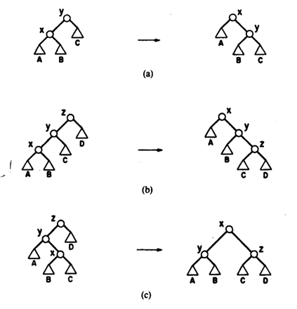
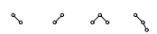
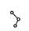
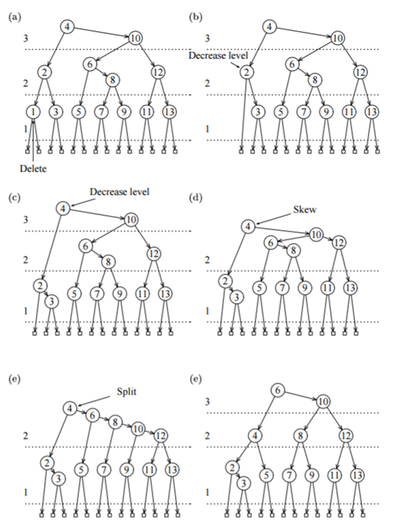

### МИНИСТЕРСТВО НАУКИ И ВЫСШЕГО ОБРАЗОВАНИЯ РОССИЙСКОЙ ФЕДЕРАЦИИ

### Федеральное государственное автономное образовательное учреждение высшего образования

## Дальневосточный федеральный университет
### ИНСТИТУТ МАТЕМАТИКИ И КОМПЬЮТЕРНЫХ ТЕХНОЛОГИЙ
### Департамент математического и компьютерного моделирования
### ДОКЛАД о практическом задании по дисциплине АИСД

# Сбалансированные деревья: Splay и AA

### Курпас Артём Викторович, гр. Б9121-09.03.03пикд

### г. Владивосток, 2022

# Содержание
# Аннотация
В данном докладе рассматриваются формы бинарного дерева - Splay-деревья и AA-деревья, описывается принцип работы и реализация этих структур данных. Исследованию подлежит их производительность относительно друг друга. 
# 1. Введение
По мере развития компьютерной сферы возникает необходимость в быстром и удобном хранилище данных, которое, в идеале, должно отвечать на все запросы быстро и хранить данные эффективно (с минимальными затратами памяти). Быстрее, чем в обычном массиве, данные можно хранить, например, используя бинарные деревья, сохраняя элементы по ключу.
Далее будут рассматриваться формы бинарного дерева поиска - Splay-деревья и АА-деревья, которые принадлежат к классу так называемых cбалансированных деревьев. 

Splay-дерево было придумано Робертом Тарьяном и Даниелем Слейтером в 1983 году. АA-дерево было придумано Арне Андерссоном в 1993 году.
## 1. 1. Глоссарий
1. Сбалансированные структуры данных - структуры данных, которые так или иначе изменяют структуру (например, используя высоту или цвет), для достижения эффективного взаимодействия с ними. 

## 1.2. Неформальная постановка задачи
1. Необходимо осуществить реализацию алгоритмов как отдельные заголовочные файлы (.h)
2. Осуществить методы взаимодействия с ними - команды *access*, *insert*, *erase*.
3. Необходимо установить асимптотическую оценку для данных алгоритмов и определить, на каких задачах они будут максимально эффективными, в том числе, используя тесты с различным набором данных.

## 1.3. Математические методы
При оценке эффективности Splay-дерева используется метод так называемого *амортизационного анализа*. Источник - Статья на Вики ИТМО: *https://neerc.ifmo.ru/wiki/index.php?title=%D0%90%D0%BC%D0%BE%D1%80%D1%82%D0%B8%D0%B7%D0%B0%D1%86%D0%B8%D0%BE%D0%BD%D0%BD%D1%8B%D0%B9_%D0%B0%D0%BD%D0%B0%D0%BB%D0%B8%D0%B7*. 

*Определение:*
**Амортизационный анализ**  (англ.  _amortized analysis_) — метод подсчёта времени, требуемого для выполнения последовательности операций над структурой данных. При этом время усредняется по всем выполняемым операциям, и анализируется средняя производительность операций в худшем случае.

*Определение:* 
**Средняя амортизационная стоимость операций** — величина $a$, находящаяся по формуле: $a = \frac{\sum_{i=1}^nt_i}{n}$ где $t$ — время выполнения операций 1, 2… $n$, совершённых над структурой данных.

Конкретно, для доказательства эффективности операций *splay*, *access*, *insert*, *erase* используется метод амортизационного анализа - *метод потенциалов*.

*Теорема (О методе потенциалов):*
Введём для каждого состояния структуры данных величину $Φ$ — потенциал. Изначально потенциал равен $Φ_0$, а после выполнения $i$-й операции — $Φ_i$. Стоимость $i$-й операции обозначим $a_i=t_i+Φ_i−Φ_i−1$. Пусть $n$ — количество операций, $m$ — размер структуры данных. Тогда средняя амортизационная стоимость операций $a=O(f(n,m))$, если выполнены два условия:
- Для любого $i:a_i=O(f(n,m))$
- Для любого $i:Φ_i=O(n⋅f(n,m))$

$$
a = \frac {∑_{i=1}^{n}t_i}{n}
= \frac {∑_{i=1}^{n}a_i\sum_{i=0}^{n-1}Φ_i - \sum_{i=1}^{n}Φ_i}{n}
= \frac {n \cdot O(f(n,m)) + Φ_0 - Φ_n}{n}
= O(f(n,m)) 
$$

## 1.4. Обзор существующих методов решения
Существуют готовые реализации рассматриваемых структур данных. 
#### Splay-дерево. 
*https://www.cs.usfca.edu/~galles/visualization/SplayTree.html*

Возможности:
 - Визуализация данных
 - Добавление, удаление, поиск элемента
 - Вывод дерева с использованием симметричного обхода
 - Выбор скорости анимации, можно приостановить / воспроизвести анимацию
 #### AA-дерево. 
*https://tjkendev.github.io/bst-visualization/red-black-tree/aa-tree.htm*

Возможности:
 - Визуализация данных
 - Добавление, удаление, поиск элемента
 - Добавление/удаление случайного элемента
 - Перемотка анимации

# 2. Требования к окружению
## 2.1. Требования к аппаратному обеспечению
- Персональный компьютер, поддерживающий компилирование C++
- Тестирующая система CATS
## 2.2. Требования к программному обеспечению
- ОС, позволяющая компилировать файлы .cpp и испольнять .exe
- Любой компилятор C++ (например, g++)
- Git
## 2.3. Требования к пользователям
- Умение работать в командой строке, выполнять базовые команды Git
- Умение пользоваться компилятором

# 3. Спецификация данных
В рассматриваемых деревьях используется структура данных Node (далее - узел). Её использование обосновано тем, что не нужно будет иметь несколько различных массивов для хранения различного рода. Узел содержит несколько полей: 
- Поле с данными, ключ
- Поле, содержащее ссылки на другие узлы

Сравнивание ключей и переход по нужной ссылке, позволит передвигаться по памяти, отведённой по дерево, для выполнения необходимых операций (см. пункт 4).

Опционально, в зависимости от реализации, имеются также поля:
- Поле с числом, содержащее текущую высоту узла, отрицательная высота не предполагается
- Поле, содержащее ссылку на родителя 

# 4. Функциональные требования
Разработанная структура данных должна:
- представлять собой библиотеку-класс (.h) с определёнными методами (далее - операции с деревом):
    - $insert(key)$ - добавить данные по ключу $key$, если найден узел с таким же ключом, заверить операцию.
    - $erase(key)$ - удалить данные по ключу $key$, если не найдено ключа *key*, то завершить операцию.
    - $access(key)$ - получить данные по ключу $key$, если не найдено ключа $key$, то вернуть *нулевой указатель*.
- хранить данные
- иметь отдельный заголовочный файл, который будет управлять ей для считывания команд из файлов (в основном, для облегчения тестирования).

Тесты должны:
- полностью покрывать функционал программы, состоять из операций с деревом
- иметь автоматическую генерацию (для больших тестов)
- покрывать производительность, затраты на время и/или память

# 5. Формальное описание алгоритмов

Splay и АА деревья являются модификациями бинарного дерева поиска. Они принадлежат классу так называемых балансирующихся структур данных. Балансировка в них происходит за счёт применения определённого набора правил, применяемых во время построения.

Обращаясь к деревьям, мы подразумеваем обращение к их корневому узлу. Дерево, корневой узел которого пустой указатель, является пустым.

#### Основные операции
- $access(i, t)$ – найти элемент $i$ и вернуть указатель на него (или вернуть `true`), если элемент есть во множестве или нулевой указатель (или вернуть `false`) – в противном случае.
- $insert(i, t)$ – вставить элемент $i$, если его ещё не существет во множестве.
- $delete(i, t)$ – удалить элемент $i$, если он есть во множестве. 
> Стоит отметить, что элемент $x$ есть в данном множестве, если применение операции *access* вернёт указатель на этот элемент. Элемента нет во множестве, если операция возвратила пустой указатель (*nullptr*).
- $join(t_1, t_2)$ – объединить деревья $t_1$ и $t_2$ в одно, которое содержит все элементы из обоих деревьев. Операция предполагает, что все элементы из $t_1$ должны быть меньше, чем минимальный из $t_2$. Возвращает указатель на новое дерево, удаляет $t_1$ и $t_2$.

## Splay-деревья

Splay-дерево является «самобалансирующейся» структурой данных. Самобалансирующиеся деревья способы проводить балансировку без использования каких-либо дополнительных полей в узлах дерева (хранение ссылки на родителя не является таковой). Например, в узлах Красно-чёрных деревьев или АВЛ-деревьев хранится, соответственно, цвет вершины или глубина поддерева. Splay-деревья всегда находятся в произовольном состоянии, т. е. они не стремятся к конкретному балансу. Наример, форма AVL-деревьев практически всегда есть форма идеально сбалансированного бинарного дерева.

Выделяют следующие преимущества самобалансирующихся структур данных:
- Требуется меньше места в памяти, так как мы не храним информацию о высоте, цвете и балансе
- Их принцип работы достаточно прост, и поэтому алгоритм реализуется быстрее

Splay-деревья призваны уменьшать время операции для наихудшего случая. Это достигается путём «выталкивания» элемента $x$ в корень дерева. Мы договариемся, что, если, применять эту *эвристику*, ответы на запросы станут быстрее. Таким образом, недавно использовавшийся элемент будет ближе к корню (откуда всегда и начинается поиск). Это позволит быстрее получить к нему доступ и совершить необходимые *операции*. 

Кроме того, учитывая то, что в большинстве реальных практических задач (напр., в базах данных) последовательности операций преобладают над отдельными операциями, поэтому по время замеров производительности будем считать, что важно не время одной кокретной операции, а общее время выполнения последовательности (так называемое *амортизированное время*).

### Splaying

Предположим, мы хотим выполнить несколько вышеперечисленных операций в дереве. Тогда, для того чтобы минимизировать общее время выполнения операций, мы должны убедиться в том, что наиболее частые по запросам элементы находятся наиболее близко к корню, так как время доступа до элемента напрямую зависит от его глубины - $O(h)$, где $h$ - глубина узла.

Как уже говорилось ранее, задача *splay*-дерева состоит в том, чтобы «перестроиться», тем самым подняв элемент $x$ выше, чтобы быстрее получить к нему доступ во время следующей операции. Это производится за счёт вращения (англ. *rotation*).

#### Одиночное вращение

Выполняется за $O(1)$ (опускаем константное количество операций, так как общее число узлов в дереве не влияет на скорость этой операции), сохраняет все свойства дерева, т. е. ключ левого сына $x$ остаётся меньше чем $x$, а ключ правого - соответсвенно больше. Вращение может быть как правым, так и левым.

Одиночное вращение от $x$ есть поворот относительно ребра, соединяющего $x$ со своим предком.

<div>
    <div style="display: flex; justify-content: center">
        
    </div>
    <p style="font-style: italic; text-align: center">Рисунок 1. Вращение относительно x. Треугольники обозначают поддеревья.</p>
</div>

#### Move to root 
Совершаем одиночные вращения от $x$, пока не убедимся, что $x$ - корень.

<div>
    <div style="display: flex; justify-content: center">
        
    </div>
    <p style="font-style: italic; text-align: center">Рисунок 2. Применение операций single_rotation и move_to_root к узлу a.</p>
</div>

К сожалению в *splay*-дереве невозможно использование операции *move_to_root*, так как, для неё найдётся такая произвольно длинная последовательность операциq, такая, что время выполнения окажется близким к $O(n)$.

Основная эвристика, используемая для перебалансировки дерева в *splay*-дереве называется *splaying*. Она преследует ту же цель, что и *move_to_root*, однако подъём в корень осуществляется при помощи чередующихся операций поворотов. Чтобы осуществить *splaying* в узле $x$, мы будем повторять следующие операции, пока $x$ не станет корнем.

#### Операции splay

> *Обозначение*. $p$ – родитель (англ. *parent*) узла $x$; 

> *Обозначение*. $g$ – прародитель (англ. *grandfather*) узла $x$, отец $p$.

*Операция 1* (*zig*). Если $p$ – родитель $x$, то совершаем поворот относительно ребра, соединяющего $p$ и $x$. (Совершается один раз и только в конце).

*Операция 2* (*zig-zig*). Если $p$ – не корень и родитель $x$, $p$ – ребенок $g$ и $x$, и $p$ – только левые дети или только правые дети, то совершаем сначала поворот относительно ребра, соединяющего $p$ и $g$, после чего совершаем поворот относительно ребра, соединяющего $x$ и $p$.

*Операция 3* (*zig-zag*). Если $p$ – не корень и $x$ - левый ребёнок $p$, а $p$ – правый ребёнок $g$ ИЛИ $x$ - правый ребёнок $p$, а $p$ – левый ребёнок $g$, то совершаем сначала поворот относительно ребра, соединяющего $x$ и $p$, после этого совершаем поворот относительно ребра, соединяющего $x$ и $g$.

<div>
    <div style="display: flex; justify-content: center">
        
    </div>
    <p style="font-style: italic; text-align: center">Рисунок 3. Применение splay к узлу x. Каждый вариант поворота имеет свой зеркальный вариант. (a) Zig: окончательное одиночное вращение. (b) Zig-zig: два одиночных вращения. (c) Zig-zag: двойное вращение.</p>
</div>

*Splay* в узле $x$ на глубине $h$ требует времени $O(h)$, что пропорционально времени, затраченному на нахождение узла $x$. Операция *splay*, помимо перемещения узла $x$, на каждой итерации грубо вдвое уменьшает глубину каждого узла (перемещает их ближе к корню) (см. Рисунок 4 и 5). Это преимущество не даёт применение более простых методов, таких как *move-to-root*, так как в них не используются такие подходы как *zig-zig* и *zig-zag*. 

<div>
    <div style="display: flex; justify-content: center">
        
    </div>
    <p style="font-style: italic; text-align: center">Рисунок 4. Применение splay к узлу a.</p>
</div>

<div>
    <div style="display: flex; justify-content: center">
        
    </div>
    <p style="font-style: italic; text-align: center">Рисунок 5. Наихудшие случаи для splay. (a) Использовано исключительно zig-zig. (b) Использовано исключительно zig-zag.</p>
</div>

#### Работа с деревом

Вышеперечисленные операции выполняются следующим образом. 

Операция $access(i, t)$ производится от корня. Если поиск достигает узла $x$, содержащего $i$, мы завершаем операцию, начиная $splay(x)$, и возвращаем указатель на $x$. Если поиск достигает нулевого указателя, то мы завершаем операцию, вызывая $splay$ от предыдущего узла, к которому был получен доступ. Если дерево пусто, мы возвращаем пустой указатель. (см. Рисунок 6.)

<div>
    <div style="display: flex; justify-content: center">
        
    </div>
    <p style="font-style: italic; text-align: center">Рисунок 6. Попытка найти узел с ключом 80.</p>
</div>

Чтобы выполнить $insert(i, t)$, мы производим поиск пустого узла, и, если достигли пустого указателя, заменяем его новым узлом, содержащим $i$, после чего производим $splay(i)$. 

Для реализации функции $delete$ используется функция $join$. Чтобы выполнить $join(t_1, t_2)$, мы ищем максимальный элемент $i$ в $t_1$. Известно, что, элемент $i$ не будет иметь правого сына. В качестве результата возвращаем новый корень $t$, с правым сыном $t_2$. 

Чтобы выполнить $delete(i, t)$, мы производим $access(i, t)$, после чего заменяем $t$ на $join(t1, t2)$, где $t_1$ – левое поддерево $t$, а $t_2$ – правое поддерево $t$.

<div>
    <div style="display: flex; justify-content: center">
        
    </div>
    <p style="font-style: italic; text-align: center;">Рисунок 7. Реализации вставки и удаления. За вставкой ключа 80 последовало удаление узла с ключом 30.</p>
</div>

## АА-деревья

АA-дерево (англ. *AA-Tree*) — структура данных, представляющая собой сбалансированное двоичное дерево поиска, которое является разновидностью *красно-черного дерева* с дополнительными ограничениями.

Наблюдение за другими структурами данных позволило понять, что можно избавиться от некоторого присущего им недостатка: большое количество рассматриваемых случаев во время балансировки можно заменить всего двумя операциями: *skew* и *split*. 

Во время работы бинарных деревьев их узлы могут принимать различного рода формы, которые должны быть обязательно рассмотрены для правильной балансировки. Именно поэтому они становятся сложнее для реализации: добавление ребра к узлу может привести к 5 различным случаям, их все нужно будет рассмотреть для выполнения балансировки.
 

AA-дерево решает эту проблему следующим образом: к одной вершине можно присоединить вершину *только того же уровня, только одну и только справа*, поэтому возможно всего 2 случая:
  

Свойства АА-дерева:
1.	Уровень каждого листа равен 1 (в различных реализациях может быть как 0, так и 1).
2.	Уровень каждого левого ребенка ровно на один меньше, чем у его родителя.
3.	Уровень каждого правого ребенка равен или на один меньше, чем у его родителя.
4.	Уровень каждого правого внука строго меньше, чем у его прародителя.
5.	Каждая вершина с уровнем больше 1 имеет двоих детей.

#### Операции балансировки

> *Определение*. Горизонтальное ребро (англ. *Horizontal edges*) — ребро, соединяющее вершины с одинаковым уровнем.

$Skew(t)$ – устранение левого горизонтального ребра (придерживаемся правила 2). Делаем правое вращение (см.пункт Одиночное вращение), чтобы заменить поддерево, содержащее левую горизонтальную связь, на поддерево, содержащее разрешенную правую горизонтальную связь.

$Split(t)$ – устранение двух последовательных правых горизонтальных ребер. Делаем левое вращение (см.пункт Одиночное вращение) и увеличиваем уровень, чтобы заменить поддерево, содержащее две или более последовательных правильных горизонтальных связи, на вершину, содержащую два поддерева с меньшим уровнем.

<div>
    <div style="display: flex; justify-content: center">
        
    </div>
    <p style="font-style: italic; text-align: center;">Рисунок 8. Операция skew(t). Устранение левой горизонтальной связи.</p>
</div>

<div>
    <div style="display: flex; justify-content: center">
        
    </div>
    <p style="font-style: italic; text-align: center;">Рисунок 9. Операция split(t). Устранение двух последовательных правых горизонтальных ребёр.</p>
</div>

Данные операции достаточно быстро реализуются простыми функциями. Помимо этого, с помощью них реализуются алгоритмы вставки и удлаения:

- $Insert(t)$ – вставка нового узла с ключом $t$ производится на уровне 1; как и обычном бинарном дереве поиска. На каждой итерации подъёма к корню в узле $t$ совершается следующая последовательность операций: 
    - $Skew(t)$
    - $Split(t)$

<div>
    <div style="display: flex; justify-content: center">
        
    </div>
    <p style="font-style: italic; text-align: center;">Рисунок 10. Вставка в AA-дереве. Уровни обозначены горизонтальным пунктиром.</p>
</div>

- $Remove(t)$ – удалить узел с уровня 1 (если $t$ не является листом, то необходимо заменить на его «предшественника» или «преемника»). На каждой итерации подъёма в корню в узле $t$ совершается следующая последовательность операций:
    - Обновляем уровни всех вершин: уровень $t$ должен быть точно на 1 больше, чем у его сыновей. Если уровень правого ребёнка $t$ больше, чем его уровень, то приравниваем уровень правого ребёнка к уровню $p$.
    - $Skew(t)$
    - $Split(t)$ 

<div>
    <div style="display: flex; justify-content: center">
        
    </div>
    <p style="font-style: italic; text-align: center;">Рисунок 11. Удаление в AA-дереве. Уровни обозначены горизонтальным пунктиром.</p>
</div>

#### Эффективность


### Дополнительные функции.

- $maxelem(node)$. Предоставлет возможность найти максимальный элемент во текущем поддереве. Мы переходим по указателю на правого сына всё время, пока не получим пустой элемент. Последний элемент, который не является пустым - максимальный. Возвращаем ссылку на него.

# 6. Проект

## 6.1. Средства реализации
Для реализации поставленной задачи хорошо подойдёт язык программирования C++ (стандарт C++14). Он позволяет работать непосредсвенно с памятью: выделять и очищать отдельные её области. Хорошим преимуществом считается его быстрота, которая достигается благодаря тому, что компилятор может применять все микрооптимизации на этапе сборки. 
В динамических языках программирования (Python, JavaScript) выполнение происходит построчно, без компиляции, что отрицательно влияет на производительность.

## 6.2. Структуры данных
В обеих деревьях на минимальная структурная единица используется узел. Узел, в зависимости от реализации, содержит разные поля. Основными являются `key` `left` `right`.

Структура (*класс*) Node, используемая в реализации Splay-дерева:
``` c++
class Node {
public:
    T key;
    Node* left;
    Node* right;
    Node* parent;
}
```
* Так как реализация не является рекурсивной, используется ссылка на родителя `Node* parent`, что требует больше памяти.

Структура (*struct*) Node, используемая в реализации AA-дерева:
``` c++
class Node {
public:
    T key;
    Node* left;
    Node* right;
    unsigned int level;
}
```

`T key` - ключ, по которому производятся сравнения. Так как используется Template (шаблон), то имеется возможность использовать произвольные данные для хранения, ввиду чего не имеет фиксированного размера, занимаемого в памяти.
`Node* left` - ссылка на левого родителя, представляет собой узел.
`Node* right` - ссылка на правого родителя, представляет собой узел.
Тип *Node* имеет размер $8$ байт в 64-разрядной системе.
`unsigned int level` - уровень текущего узла. Позволяет хранить значения от $0$ до $4294967295$ включительно. Использование именно этого типа данных обосновано тем, что уровень не может быть отрицательным (в данной реализации). Максимально возможная высота дерева при этом составит $2^{4294967295}$, чего с запасом хватит для выполнения огромного спектра задач. 
Например, мы создаём AA-дерево, расчитанное на работу с целочисленными данными (*int*) в 64-битной системе. Тогда поле:
- `key`будет занимать 4 байта
- `left`и `right` будут занимать 16 байт
- `level` будет занимать 4 байта
Таким образом, на один узел будет приходиться $24$ байта в памяти. Для $1 000 000$ хранимых элементов затраты памяти составят $1 000 000 * 24 = 24 000 000 \approx 24$ МБайт - $O(n)$. 

Аналогичные расчёты можно провести и с *Splay*-деревом. Тогда, дерево из $1 000 000$ элементов, расчитанное на работу с данными типа *int* в 64-битной системе будет занимать $1 000 000 * (4 + 8 * 3) = 32 000 000 \approx 32$ Мбайт с учётом битового выравнивания - $O(n)$. 

Для экономии памяти создаётся и используется указатель на элемент `NULL` - пустой указатель. При инициализации дерева он будет находится в опредёленной области памяти и все элементы, определённые как пустые будут ссылаться на него.

## 6.3 Модули и алгоритмы

Нужно отметить, что в Splay-дереве используется нерекурсивная реализация циклами, в то время как в AA-дереве используется рекурсивная. Может возникнуть предположение, что данные реализации сравнивать некорректно, однако:
    - Рекурсия помогает сделать код проще и понятнее, что и является преимуществом АА-дерева
    - На практике стек рекурсии не вызывает проблем
    - Если нам очень важно общее время работы с деревом, то оба дерева не являются идеальными в этом вопросе


Реализация *Splay* и *AA*-деревьев представляет собой отдельные библиотеки (заголовочные файлы). В обоих реализациях используется *template* (общий тип) для облегечения тестирования: мы можем использовать деревья как на числах типа `int`, `double`, `long`, так и на строках типа `string`.

 ### splay-tree.h

Структура, декларующая узел и её конструктор. Конструктор принимает два аргумента, второй не обязателен. Конструктор позволяет выделить память под новый узел с уже имеющимся ключом, и узазать ссылку на родителя.
```c++
template <typename T> class SplayTree {
private:
    typedef struct Node {
        T key;
        Node* left;
        Node* right;
        Node* parent;

        Node(T key, Node* parent = nullptr) {
            this->key = key;
            this->left = nullptr;
            this->right = nullptr;
            this->parent = parent;
        }
    }
```
Этот и последующие методы являются служебными. Есть необходимость обезопасить пользователя от случайных вызовов этих методов, ввиду чего они все перечислены в `private`.

Метод $leftrotate(x)$, совершает левый поворот - $zig(x)$. Принимает узел `Node` в качестве аргумента:
```c++
    void _left_rotate(Node* x) {
        if (x == this->root)
            return;

        Node* p = x->parent;
        Node* g = nullptr;

        if (p->parent != nullptr) {
            g = p->parent;
            if (g->left == p)
                g->left = x;
            else if (g->right == p)
                g->right = x;
        }
        else
            this->root = x;

        p->right = x->left;
        if (p->right != nullptr)
            p->right->parent = p;

        p->parent = x;
        x->left = p;
        x->parent = g;
    }
```

Метод $rightrotate(x)$, совершает правый поворот - $zig(x)$. Принимает узел `Node` в качестве аргумента:
```c++
    void _right_rotate(Node* x) {
        if (x == this->root)
            return;

        Node* p = x->parent;
        Node* g = nullptr;

        if (p->parent != nullptr) {
            g = p->parent;
            if (g->left == p)
                g->left = x;
            else if (g->right == p)
                g->right = x;
        }
        else
            this->root = x;

        p->left = x->right;
        if (p->left != nullptr)
            p->left->parent = p;

        p->parent = x;
        x->right = p;
        x->parent = g;
    }
```

Метод $splay(x)$, принимает узел `Node` в качестве аргумента. Координирует использование левых и правых поворотов.
```c++
    void _splay(Node* node) {
        if (node == this->root)
            return;

        Node* p;
        Node* g;

        while (node->parent != nullptr) {
            p = node->parent;

            if (p->left == node) {
                if (p->parent != nullptr) {
                    g = p->parent;
                    //zig-zig right-right
                    if (g->left == p) {
                        this->_right_rotate(p);
                        this->_right_rotate(node);
                    }
                    //zig-zag right-left
                    else {
                        this->_right_rotate(node);
                        this->_left_rotate(node);
                    }
                }
                else {
                    //zig right
                    this->_right_rotate(node);
                }
            }
            else {
                if (p->parent != nullptr) {
                    g = p->parent;
                    //zig-zag left-right
                    if (g->left == p) {
                        this->_left_rotate(node);
                        this->_right_rotate(node);
                    }
                    //zig-zig left-left
                    else {
                        this->_left_rotate(p);
                        this->_left_rotate(node);
                    }
                }
                else {
                    //zig left
                    this->_left_rotate(node);
                }
            }
        }
    }
```

Метод $maxelem(node)$, принимающий в качестве аргумента узел `Node` и возвращающий указатель на максимальный элемент в текущем поддереве.
```C++
    Node* _max_elem (Node* node) {
        if (node == nullptr)
            return node;

        while (node->right != nullptr)
            node = node->right;

        return node;
    }
```

Метод, принимающий в качестве аргумента два узла `Node`. Предпологается, что они являются корнями деревьев $t_1$ и $t_2$. Метод возвращает новое дерево $t$.
```c++
    Node* _join(Node* t1, Node* t2) {
        auto *t = new SplayTree(t1);

        t->_splay(_max_elem(t->root));
        t->root->right = t2;
        t2->parent = t->root;

        [[unlikely]] if (t->root->parent != nullptr)
            t->root->parent = nullptr;

        return t->root;
    }
```

Метод $-access(key)$. Предоставляет возможность найти и вернуть указатель на элемент $key$, находящийся во множестве.
```c++
    Node* _access(T key) {
        Node* node = this->root;

        while (node != nullptr) {
            if (key < node->key)
                node = node->left;
            else if (key > node->key)
                node = node->right;
            else {
                this->_splay(node);
                return node;
            }
        }

        return nullptr;
    }
```

Все последующие методы находятся в `public`. Через них пользователь осуществляет необходимые операции.

Узел `Node`. Представляет собой указатель на корень дерева.

```c++
public:
    Node* root;
```

Конструкторы *Splay*-дерева. Выделяют память под новый объект и инициализируют корень. Второй конструктор присваивает `root` уже известное значение, которое передаётся в качестве аргумента. Также содержит ключевое слово `explicit`, которое исключает возможность создания объекта неявно, т. е., есть всего 1 способ инициализировать *Splay*-дерево.
```c++
    SplayTree() {
        this->root = nullptr;
    }

    explicit SplayTree(Node* root) {
        this->root = root;
    }
```   

Метод $access(x)$, принимающий ключ $key$ в качестве аргумента. Вызывает ранее декларированный метод $-access(key)$ и возвращает $true$ или $false$, в зависимости от того, существует он или нет.
```c++
    bool access(T key) {
        Node* result = this->_access(key);
        if (result != nullptr && result->key == key)
            return true;
        return false;
    }
```

Метод $insert(key)$:
```c++
    void insert(T key) {
        if (this->root == nullptr) {
            this->root = new Node(key);
            return;
        }

        Node* node = this->root;
        Node* parent = nullptr;

        while (node != nullptr) {
            parent = node;

            if (key < node->key)
                node = node->left;
            else if (key > node->key)
                node = node->right;
            else
                return;
        }

        Node* new_node = new Node(key, parent);
        node = new_node;

        if (parent->key > node->key)
            parent->left = node;
        else if (parent->key < node->key)
            parent->right = node;

        this->_splay(node);
    }
```

Метод $erase(key)$:
```c++
    bool erase(T key) {
        Node* node = this->_access(key);
        if (node == nullptr)
            return false;

        Node* t1 = node->left;
        Node* t2 = node->right;

        if (t1 != nullptr && t2 != nullptr) {
            this->root = this->_join(t1, t2);
        }
        else if (t1 != nullptr) {
            t1->parent = nullptr;
            this->root = t1;
        }
        else if (t2 != nullptr) {
            t2->parent = nullptr;
            this->root = t2;
        }
        else {
            this->root = nullptr;
        }

        delete node;

        return true;
    }
};
 ```

 ### aa-tree.h

 ```c++
 
 ```

 # 7. Реализация и тестирование

 Стоит отметить, что мы тестируем деревья на одних и тех же элементах (т. е добавление, удаление, поиск одних и тех же узлов в обоих деревьях). Замеры количества операций не производятся на функциях, которые имеют константное время выполнения, например:
 ```c++
Node* _left_rotate(Node* node) {
    Node* right = node->right;
    node->right = right->left;
    right->left = node;

    return right;
}
 ```
 Здесь количество элементов в дереве не влияет количество присвоений и, соответственно, на время выполнения. Всегда будет $O(3)$.

Количество совершенных действий в структуре данных записывается в переменную `_comparisons` и напрямую зависит от числа элементов во множестве.

# Заключение

# Список литературы
- Splay-деревья. Статья на Вики ИТМО. *https://neerc.ifmo.ru/wiki/index.php?title=Splay-%D0%B4%D0%B5%D1%80%D0%B5%D0%B2%D0%BE*
- Sleator, Daniel D.; Tarjan, Robert E."Self-Adjusting Binary Search Trees" *http://www.cs.cmu.edu/~sleator/papers/self-adjusting.pdf*
- Uppsala University — Balanced searched trees made simple http://user.it.uu.se/~arnea/ps/simp.pdf
- AA-деревья. Статья на Вики ИТМО. *https://neerc.ifmo.ru/wiki/index.php?title=AA-%D0%B4%D0%B5%D1%80%D0%B5%D0%B2%D0%BE*
- Реализация AA-дерева. *https://www.geeksforgeeks.org/aa-trees-set-1-introduction*
- Реализация Splay-дерева. *https://www.geeksforgeeks.org/splay-tree-set-3-delete*
- Необработанные указатели (C++). *https://learn.microsoft.com/ru-ru/cpp/cpp/raw-pointers?view=msvc-170*
- Типы данных. Статья на Metanit. *https://metanit.com/cpp/tutorial/2.3.php*
- Расставим точки над структурами C/C++. *https://habr.com/ru/post/142662/*
- AVL-деревья. Статья на Вики ИТМО. *https://neerc.ifmo.ru/wiki/index.php?title=%D0%90%D0%92%D0%9B-%D0%B4%D0%B5%D1%80%D0%B5%D0%B2%D0%BE*
- Красно-чёрные деревья. Статья на Вики ИТМО. *https://neerc.ifmo.ru/wiki/index.php?title=%D0%9A%D1%80%D0%B0%D1%81%D0%BD%D0%BE-%D1%87%D0%B5%D1%80%D0%BD%D0%BE%D0%B5_%D0%B4%D0%B5%D1%80%D0%B5%D0%B2%D0%BE*