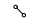

### МИНИСТЕРСТВО НАУКИ И ВЫСШЕГО ОБРАЗОВАНИЯ РОССИЙСКОЙ ФЕДЕРАЦИИ

### Федеральное государственное автономное образовательное учреждение высшего образования

## Дальневосточный федеральный университет
### ИНСТИТУТ МАТЕМАТИКИ И КОМПЬЮТЕРНЫХ ТЕХНОЛОГИЙ
### Департамент математического и компьютерного моделирования
### ДОКЛАД о практическом задании по дисциплине АИСД

# Сбалансированные деревья: Splay и AA

### Курпас Артём Викторович, гр. Б9121-09.03.03пикд

### г. Владивосток, 2022

# Содержание

- [1. Введение](#1-введение)
    - [1.1. Неформальная постановка задачи](#11-неформальная-постановка-задачи)
    - [1.2. Математические методы](#12-математические-методы)
    - [1.3. Обзор существующих методов решения](#13-обзор-существующих-методов-решения)
- [2. Спецификация данных](#2-спецификация-данных)
- [3. Функциональные требования](#3-функциональные-требования)
- [4. Формальное описание алгоритмов](#4-формальное-описание-алгоритмов)
- [5. Проект](#5-проект)
    - [5.1. Cредства реализации](#51-средства-реализации)
    - [5.2. Структуры данных](#52-структуры-данных)
    - [5.3. Модули и алгоритмы](#53-модули-и-алгоритмы)
- [6. Реализация и тестирование](#6-реализация-и-тестирование)
    - [6.1 Методология тестирования](#61-методология-тестирования)
    - [6.2 Вычислительный эксперимент](#62-вычислительный-эксперимент)

# Аннотация

В данном докладе рассматриваются формы бинарного дерева - **splay-деревья** и **AA-деревья**, описывается принцип работы и реализация этих структур данных. Исследованию и сравнению подлежит их производительность. 

# 1. Введение

По мере развития компьютерной сферы возникает необходимость в быстром и удобном хранилище данных, которое, в идеале, должно отвечать на все запросы быстро и хранить данные эффективно (с минимальными затратами памяти). Быстрее, чем в обычном массиве, данные можно хранить, например, используя бинарные деревья, сохраняя элементы по ключу.

Бинарные деревья содержат множества элементов. Чаще всего каждый элемент уникален, т. е., не допускается, чтобы одни и те же элементы повторялись. 

Далее будут рассматриваться формы бинарного дерева поиска - **splay-деревья** и **АА-деревья**, которые принадлежат к классу так называемых **cбалансированных деревьев**, т. е, существует набор правил для поддержания саморегуляции (изменения собственной структуры).

**Splay-дерево** было придумано Робертом Тарьяном и Даниелем Слейтером в 1983 году. 

**АA-дерево** было придумано Арне Андерссоном в 1993 году.

## 1.1. Неформальная постановка задачи
1. Необходимо осуществить реализацию алгоритмов как отдельные заголовочные файлы (.h)
2. Осуществить методы взаимодействия с ними - команды $access$, $insert$, $erase$.
3. Необходимо установить асимптотическую оценку для данных алгоритмов и определить, на каких задачах они будут максимально эффективными, в том числе, используя тесты с различным набором данных; определить соответствует ли время работы реализованного алгоритма теоритической оценке.

> Здесь и далее в документе под **временем работы** подразумевается **асимптотическая оценка алгоритма**.

> **Асимптотическая оценка алгоритма** – это функция $O$-cимволики, позволяющая определить, как быстро увеличивается время работы алгоритма с увеличением объёма данных.

## 1.2. Математические методы
При оценке эффективности **splay-дерева** используется метод так называемого *амортизационного анализа*. [Источник](https://neerc.ifmo.ru/wiki/index.php?title=%D0%90%D0%BC%D0%BE%D1%80%D1%82%D0%B8%D0%B7%D0%B0%D1%86%D0%B8%D0%BE%D0%BD%D0%BD%D1%8B%D0%B9_%D0%B0%D0%BD%D0%B0%D0%BB%D0%B8%D0%B7).

> *Определение:*
**Амортизационный анализ**  (англ.  _amortized analysis_) — метод подсчёта времени, требуемого для выполнения последовательности операций над структурой данных. При этом время усредняется по всем выполняемым операциям, и анализируется средняя производительность операций в худшем случае.

> *Определение:* 
**Средняя амортизационная стоимость операций** — величина $T'$, находящаяся по формуле: $T' = \frac{\sum_{i=1}^nt_i}{n}$ где $t_i$ — время выполнения операций 1, 2… $n$, совершённых над структурой данных.

> *Теорема (О методе потенциалов):*
Введём для каждого состояния структуры данных величину $Φ$ — потенциал. Изначально потенциал равен $Φ_0$, а после выполнения $i$-й операции — $Φ_i$. Стоимость $i$-й операции обозначим $a_i=t_i+Φ_i−Φ_i−1$. Пусть $n$ — количество операций, $m$ — размер структуры данных. Тогда средняя амортизационная стоимость операций $a=O(f(n,m))$, если выполнены два условия:
    - Для любого $i$: $a_i=O(f(n,m))$
    - Для любого $i$: $Φ_i=O(n⋅f(n,m))$

### Оценка эффективности $splay(x)$

[Источник](https://neerc.ifmo.ru/wiki/index.php?title=Splay-%D0%B4%D0%B5%D1%80%D0%B5%D0%B2%D0%BE)

Для оценки эффективности $splay$ будет использоваться **метод потенциалов**. Потенциалом рассматриваемого дерева назовём сумму рангов его вершин. Ранг вершины $x$ — это величина, обозначаемая $r(x)$ и равная $log_2C(x)$, где $C(x)$ — количество вершин в поддереве с корнем в $x$.

> *Лемма*
Амортизированное время операции $splay$ вершины $x$ в дереве с корнем $t$ не превосходит $1+3(r(t)−r(x))$
$$T'(splay(x)) \leqslant 1+3(r(t)−r(x))$$

> *Доказательство*

Проанализируем каждый шаг операции splay. Пусть $r'$ и $r$ — ранги вершин после шага и до него соответственно, $p$ — предок вершины $x$, а $g$ — предок $p$.

Разберём случаи в зависимости от типа шага:

$zig(x)$. Поскольку выполнен один поворот, то амортизированное время выполнения шага $T'=1+r'(x)+r'(p)−r(x)−r(p)$ (поскольку только у вершин $x$ и $p$ меняется ранг). Ранг вершины $p$ уменьшился, поэтому $r'(p)−r(p)⩽0$. Ранг вершины $x$ увеличился, поэтому $r'(x)−r(x)⩾0$. Следовательно, $T(zig(x))⩽1+3r'(x)−3r(x)$.

$zig-zig(x)$. Выполнено два поворота, амортизированное время выполнения шага $T'=2+r'(x)+r'(p)+r'(g)−r(p)−r(x)−r(g)$. Поскольку после поворотов поддерево с корнем в $x$ будет содержать все вершины, которые были в поддереве с корнем в $g$ (и только их), поэтому $r'(x)=r(g)$. Используя это равенство, получаем: $T'=2+r'(p)+r'(g)−r(x)−r(p)⩽2+r'(p)+r'(g)−2r(x)$, поскольку $r(x)⩽r(p)$. 

Далее, так как $r'(p)⩽r'(x)$, получаем, что $T'⩽2+r'(x)+r'(g)−2r(x)$.

Мы утверждаем, что эта сумма не превосходит $3(r'(x)−r(x))$, то есть, что $r(x)+r'(g)−2r'(x)⩽−2$. Преобразуем полученное выражение следующим образом: $(r(x)−r′(x))+(r′(g)−r′(x))=log_2\frac{C(x)}{C′(x)}+log_2\frac{C′(g)}{C′(x)}$.

Из рисунка видно, что $C'(g)+C(x)⩽C'(x)$, значит, сумма выражений под логарифмами не превосходит единицы. Далее, рассмотрим сумму логарифмов $log_2a+log_2b=log_2ab$. При $a+b⩽1$ произведение $ab$ по неравенству между средними не превышает $14$. А поскольку логарифм — функция возрастающая, то $log_2ab⩽−2$, что и является требуемым неравенством.

$zig-zag(x)$. Выполнено два поворота, амортизированное время выполнения шага $T'=2+r'(x)+r'(p)+r'(g)−r(x)−r(p)−r(g)$. Поскольку $r'(x)=r(g)$, то $T'=2+r'(p)+r'(g)−r(x)−r(p)$. Далее, так как $r(x)⩽r(p)$, то $T'⩽2+r'(p)+r'(g)−2r(x)$.

Мы утверждаем, что эта сумма не превосходит $2(r'(x)−r(x))$, то есть, что $r'(p)+r'(g)−2r'(x)⩽−2$. Но, поскольку $r'(p)+r'(g)−2r'(x)=log_2\frac{C'(p)}{C'(x)}+log_2\frac{C'(g)}{C'(x)}⩽−2$ - аналогично доказанному ранее, что и требовалось доказать.

Итого, получаем, что амортизированное время шага $zig-zag$ не превосходит $2(r'(x)−r(x))⩽3(r'(x)−r(x))$.

Поскольку за время выполнения операции $splay$ выполняется не более одного шага типа $zig$, то суммарное время не будет превосходить $3r(t)−3r(x)+1$, поскольку утроенные ранги промежуточных вершин сокращаются (входят в сумму как с плюсом, так и с минусом). Тогда суммарное время работы $splay$: $$T_{splay}⩽3log_2N−3log_2C(x)+1=O(log_2N),$$ где $N$ — число элементов в дереве.

## 1.3. Обзор существующих методов решения
Существуют готовые реализации рассматриваемых структур данных. 
#### Splay-дерево
[Браузерная реализация](https://www.cs.usfca.edu/~galles/visualization/SplayTree.html)

Возможности:
 - Визуализация данных;
 - Добавление, удаление, поиск элемента;
 - Вывод дерева с использованием симметричного обхода;
 - Выбор скорости анимации, можно приостановить (воспроизвести) анимацию;

 #### AA-дерево
[Браузерная реализация](https://tjkendev.github.io/bst-visualization/red-black-tree/aa-tree.html)

Возможности:
 - Визуализация данных;
 - Добавление, удаление, поиск элемента;
 - Добавление (удаление) случайного элемента;
 - Перемотка анимации;

# 2. Спецификация данных
В рассматриваемых деревьях используется структура данных **Node** (далее - узел).

Узел содержит несколько полей: 
- Поле с данными, ключ;
- Поля, содержащее ссылки на другие узлы;

Сравнение ключей и переход по нужной ссылке позволит передвигаться по памяти, отведённой по дерево, для выполнения [необходимых операций](#3-функциональные-требования).

> Далее под **операциями с деревом** будут подразумеваться операции вставки, получения доступа (поиска), удаления.

Опционально, в зависимости от реализации, имеются также:
- Поле с числом, содержащее текущую высоту узла, отрицательная высота не предполагается;
- Поле, содержащее ссылку на родителя ;

# 3. Функциональные требования
Разработанная структура данных должна:
- представлять собой библиотеку-класс (.h) с определёнными *методами* (операциями):
    - вставки;
    - удаления;
    - получения доступа (поиска);
- хранить данные;

Тесты должны:
- полностью покрывать функционал программы, представлять собой перечисления пар [операция] + [ключ];
- иметь автоматическую генерацию (для больших тестов);
- замерять производительность (кол-во операций) и затраты времени;

# 4. Формальное описание алгоритмов

**Splay** и **АА деревья** являются модификациями бинарного дерева поиска. Они принадлежат классу так называемых *cбалансированных структуры данных*. Балансировка в них происходит за счёт определённого набора правил.

> Обращаясь к дереву, мы подразумеваем обращение к его корневому узлу. Дерево, корневой узел которого пустой, является пустым.

#### Основные операции

- $access(x)$ – найти элемент $x$ и вернуть указатель на него (или вернуть `true`), если элемент есть во множестве или нулевой указатель (или вернуть `false`) – в противном случае.
- $insert(x)$ – вставить элемент $x$, если его ещё не существет во множестве.
- $delete(x)$ – удалить элемент $x$, если он есть во множестве. 

> Стоит отметить, что элемент $x$ есть в данном множестве, если применение операции *access* вернёт указатель на этот элемент. Элемент отсутсвует во множестве, если эта операция возвратила пустой указатель `nullptr`.

- $join(t_1, t_2)$ – объединить деревья $t_1$ и $t_2$ в одно, которое содержит все элементы из обоих деревьев. Операция предполагает, что все элементы из $t_1$ должны быть меньше, чем минимальный из $t_2$. Возвращает указатель на новое дерево, удаляет $t_1$ и $t_2$.

## Splay-деревья

**Splay-дерево** является «самобалансирующейся» структурой данных. Самобалансирующиеся деревья способы проводить балансировку без использования каких-либо дополнительных полей в узлах дерева (хранение ссылки на родителя является исключением). Например, в узлах Красно-чёрных деревьев или АВЛ-деревьев хранится, соответственно, цвет вершины или глубина поддерева. Splay-деревья всегда находятся в произовольном состоянии, т. е. они будут максимально сбалансированы реже, чем, например, AVL-деревеья.

> *Определение*. **Полностью сбалансированное дерево** - дерево, чьи любые две соседние вершины отличаются на не более чем $1$ ед. по высоте. 

<div>
    <div style="display: flex; justify-content: center">
        
    </div>
    <p style="font-style: italic; text-align: center">Рисунок 1. Полностью сбалансированное дерево поиска</p>
</div>

Выделяют следующие преимущества самобалансирующихся структур данных:
- Требуется меньше места в памяти, так как мы не храним информацию о высоте, цвете и балансе;
- Реализация становится проще, потому что мы производим балансировку всегда, т. е., избегаем написания цепочек проверок. 

**Splay-деревья** теоритически должны уменьшать время операции для наихудшего случая. Это достигается путём «выталкивания» текущего элемента $x$ в корень дерева. Таким образом, недавно использовавшийся элемент будет ближе к корню (откуда всегда и начинается поиск). Это позволит быстрее получить к нему доступ и совершить необходимые операции. 

Кроме того, учитывая то, что в большинстве реальных практических задач (напр., в базах данных) последовательности операций преобладают над отдельными операциями, поэтому по время замеров производительности будем считать, что важно не время одной конкретной операции, а общее время выполнения последовательности.

### Splaying

Предположим, мы хотим выполнить несколько вышеперечисленных *операций* в дереве. Тогда, для того чтобы минимизировать общее время выполнения операций, мы должны убедиться в том, что наиболее частые по запросам элементы находятся наиболее близко к корню, так как время доступа до элемента напрямую зависит от его глубины - $O(h)$, где $h$ - глубина узла.

Операция $splay(x)$ осуществляет подъём узла $x$ в корень дерева, тем самым уменьшает его глубину $h$. Это осуществяется при помощи поворотов, чередующихся специальным образом.

#### Одиночное вращение

Выполняется за $O(1)$ (опускаем константное количество операций, так как общее число узлов в дереве не влияет на скорость этой операции), сохраняет все свойства дерева, т. е. ключ левого сына $x$ остаётся меньше чем $x$, а ключ правого - соответственно больше. Вращение может быть как правым, так и левым.

Одиночное вращение от $x$ есть поворот относительно ребра, соединяющего $x$ со своим предком.

<div>
    <div style="display: flex; justify-content: center">
        
    </div>
    <p style="font-style: italic; text-align: center">Рисунок 2. Вращение относительно x. Треугольники обозначают поддеревья.</p>
</div>

#### Операции $splay(x)$

> *Обозначение*. $p$ – родитель (англ. *parent*) узла $x$; 

> *Обозначение*. $g$ – прародитель (англ. *grandfather*) узла $x$, отец $p$.

**1.** $zig(x)$. Если $p$ – родитель $x$, то совершаем поворот относительно ребра, соединяющего $p$ и $x$. (Совершается один раз и только в конце).

**2.** $zig-zig(x)$. Если $p$ – не корень и родитель $x$, $p$ – ребенок $g$, а $x$ и $p$ – только левые дети или только правые дети, то совершаем сначала поворот относительно ребра, соединяющего $p$ и $g$, после чего совершаем поворот относительно ребра, соединяющего $x$ и $p$.

**3.** $zig-zag(x)$. Если $p$ – не корень и $x$ - левый ребёнок $p$, а $p$ – правый ребёнок $g$ ИЛИ $x$ - правый ребёнок $p$, а $p$ – левый ребёнок $g$, то совершаем сначала поворот относительно ребра, соединяющего $x$ и $p$, после этого совершаем поворот относительно ребра, соединяющего $x$ и $g$.

<div>
    <div style="display: flex; justify-content: center">
        
    </div>
    <p style="font-style: italic; text-align: center">Рисунок 3. Применение splay к узлу x. Каждый вариант поворота имеет свой зеркальный вариант. (a) Zig: окончательное одиночное вращение. (b) Zig-zig: два одиночных вращения. (c) Zig-zag: двойное вращение.</p>
</div>

$Splay(x)$ на глубине $h$ требует времени $O(h)$, что пропорционально времени, затраченному на нахождение узла $x$. Помимо этого, на каждой итерации **грубо** вдвое уменьшается глубина каждого узла (они перемещаются ближе к корню) (см. Рисунок 4 и 5).

<div>
    <div style="display: flex; justify-content: center">
        
    </div>
    <p style="font-style: italic; text-align: center">Рисунок 4. Применение splay к узлу a.</p>
</div>

<div>
    <div style="display: flex; justify-content: center">
        
    </div>
    <p style="font-style: italic; text-align: center">Рисунок 5. Наихудшие случаи для splay. (a) Использовано исключительно zig-zig. (b) Использовано исключительно zig-zag.</p>
</div>

#### Работа с деревом

Вышеперечисленные операции для **splay-дерева** выполняются следующим образом. 

Операция $access(i)$ производится от корня. Если поиск достигает узла $x$, содержащего $i$, мы завершаем операцию, начиная $splay(x)$, и возвращаем указатель на $x$. Если поиск достигает нулевого указателя, то мы завершаем операцию, вызывая $splay$ от предыдущего узла, к которому был получен доступ. Если дерево пусто, мы возвращаем пустой указатель. (см. Рисунок 6). Так как получение доступа к узлу $x$ и $splay(x)$ осуществляются за $O(h)$, где $h$ - глубина узла $x$, то общее время работы $access(x)$: 

$$T(access(s) = h(x) + h(x) \leqslant 2T(splay(x)))$$


<div>
    <div style="display: flex; justify-content: center">
        
    </div>
    <p style="font-style: italic; text-align: center">Рисунок 6. Попытка найти узел с ключом 80.</p>
</div>

Чтобы выполнить $insert(x)$, спускаемся в самый низ дерева, и, если достигли пустого указателя, заменяем его новым узлом, содержащим $i$, после чего производим $splay(x)$. Так как поиск пустого узла $x$ и $splay(x)$ осуществляются за $O(h)$, где $h$ - глубина дерева $x$, то общее время работы $insert(x)$ аналогично времени работы операции $access(x)$.

Для реализации функции $delete$ используется функция $join$. Чтобы выполнить $join(t_1, t_2)$, мы ищем максимальный элемент $i$ в $t_1$, осуществляем $splay(i)$. Известно, что элемент $i$ не будет иметь правого сына. В качестве результата возвращаем новый корень $t$, с правым сыном $t_2$. 

Чтобы выполнить $delete(x)$, мы производим $access(x)$, после чего заменяем $t$ (корень) на $join(t1, t2)$, где $t_1$ – левое поддерево $t$, а $t_2$ – правое поддерево $t$. Так как в основе этой операции лежит $access(x)$, то общее время работы будет не более, чем $T(access(x))$

<div>
    <div style="display: flex; justify-content: center">
        
    </div>
    <p style="font-style: italic; text-align: center;">Рисунок 7. Реализации вставки и удаления. За вставкой ключа 80 последовало удаление узла с ключом 30.</p>
</div>

Исходя из вышеперечисленного, все операции к узлу $x$ будут гарантированно работать столько же, сколько работает $splay(x)$, поэтому последующую оценку эффективности можно производить исключительно изучив время работы $splay(x)$ (см. [*1.2. Математические методы*](#12-математические-методы)).

Учитывая то, что после выполнения любой операции над данным деревом, нужно осуществить $splay(x)$ на такую же глубину, то время выполнения любой операции будет не более чем $T(2splay(x))$.
Так как время работы $splay(x)$ не более, чем $O(log_2N)$, то имеем:
$$T(access(x))\leqslant O(log_2N),$$
$$T(insert(x))\leqslant O(log_2N),$$
$$T(erase(x))\leqslant O(log_2N).$$

## АА-деревья

**АA-дерево** (англ. *AA-Tree*) — структура данных, представляющая собой сбалансированное двоичное дерево поиска, которое является разновидностью *красно-черного дерева* с дополнительными ограничениями.

Наблюдение за другими структурами данных позволило прийти к выводу, что можно избавиться от некоторого присущего им недостатка: большое количество рассматриваемых случаев во время балансировки можно заменить всего двумя операциями: $skew$ и $split$. 

Во время работы бинарных деревьев их узлы могут принимать различного рода формы, которые должны быть обязательно рассмотрены для правильной балансировки. Именно поэтому они становятся сложнее для реализации: добавление ребра к узлу можно свести к $5$ различным случаям, их все нужно будет рассмотреть для выполнения балансировки.
 

AA-дерево решает эту проблему следующим образом: к одной вершине можно присоединить вершину **только того же уровня, только одну и только справа**, поэтому возможно всего $2$ случая:
  

#### Свойства АА-дерева

1.	Уровень каждого листа равен $1$ (в различных реализациях может быть как $0$, так и $1$)
2.	Уровень каждого левого ребенка ровно на один меньше, чем у его родителя
3.	Уровень каждого правого ребенка равен или на один меньше, чем у его родителя
4.	Уровень каждого правого внука строго меньше, чем у его прародителя
5.	Каждая вершина с уровнем больше $1$ имеет двоих детей

#### Операции балансировки

> *Определение*. Горизонтальное ребро (англ. *Horizontal edges*) — ребро, соединяющее вершины с одинаковым уровнем.

$skew(x)$ – устранение левого горизонтального ребра (придерживаемся правила 2). Осуществляем *правое вращение*, упомянутое выше, чтобы заменить поддерево, содержащее левую горизонтальную связь, на поддерево, содержащее разрешенную правую горизонтальную связь.

$split(x)$ – устранение двух последовательных правых горизонтальных ребер. Делаем *левое вращение*, упомянутое выше, и увеличиваем уровень, чтобы заменить поддерево, содержащее две или более последовательных правильных горизонтальных связи, на вершину, содержащую два поддерева с меньшим уровнем.

Так как время выполнения обоих операций не зависит от общего числа элементов и константно, то можно утверждать, что они выполняются за $O(1)$.

<div>
    <div style="display: flex; justify-content: center">
        
    </div>
    <p style="font-style: italic; text-align: center;">Рисунок 8. Операция skew(x). Устранение левой горизонтальной связи.</p>
</div>

<div>
    <div style="display: flex; justify-content: center">
        
    </div>
    <p style="font-style: italic; text-align: center;">Рисунок 9. Операция split(x). Устранение двух последовательных правых горизонтальных ребёр.</p>
</div>

Данные операции достаточно быстро реализуются простыми функциями. Помимо этого, с помощью них реализуются алгоритмы вставки и удаления:

#### Работа с деревом
- $access(x)$ - как и обычном бинарном дереве поиска: спускаемся от корня к искомому элементу $x$

- $insert(x)$ – вставка нового узла с ключом $x$ производится на уровне 1; как и обычном бинарном дереве поиска. На каждой итерации подъёма к корню в узле $x$ совершается следующая последовательность операций: 
    - $skew(x)$
    - $split(x)$

<div>
    <div style="display: flex; justify-content: center">
        
    </div>
    <p style="font-style: italic; text-align: center;">Рисунок 10. Вставка в AA-дереве. Уровни обозначены горизонтальным пунктиром.</p>
</div>

- $delete(x)$ – удалить узел с уровня 1 (если $x$ не является листом, то необходимо заменить на его «предшественника» или «преемника»). На каждой итерации подъёма в корню в узле $x$ совершается следующая последовательность операций:
    - Обновляем уровни всех вершин: уровень $x$ должен быть точно на 1 больше, чем у его сыновей. Если уровень правого ребёнка $x$ больше, чем его уровень, то приравниваем уровень правого ребёнка к уровню $p$.
    - $skew(x)$
    - $split(x)$ 

<div>
    <div style="display: flex; justify-content: center">
        
    </div>
    <p style="font-style: italic; text-align: center;">Рисунок 11. Удаление в AA-дереве. Уровни обозначены горизонтальным пунктиром.</p>
</div>

Высота **АА-дерева** оценивается сверху как $2log_2(N)$, следовательно наихудшее время получения доступа к элементу $x$ будет $2log_2(N)$. Зная, что в основе операций вставки и удаления лежит операция получения доступа, то, добавляя время выполнения операция балансировки и обрасывая константы, утверждаем, что:

$$T(access(x)) \leqslant O(log_2(N))$$
$$T(insert(x)) \leqslant O(log_2(N))$$
$$T(erase(x)) \leqslant O(log_2(N))$$

### Дополнительные функции

Вспомогательные функции, которые используются в реализации.

- $maxelem(node)$. Предоставлет возможность найти максимальный элемент во текущем поддереве. Мы переходим по указателю на правого сына всё время, пока не получим пустой элемент. Последний элемент, который не является пустым - максимальный. Возвращаем ссылку на него.

- $minelem(node)$. Предоставлет возможность найти минимальный элемент во текущем поддереве. Мы переходим по указателю на левого сына всё время, пока не получим пустой элемент. Последний элемент, который не является пустым - минимальный. Возвращаем ссылку на него.

# 5. Проект

## 5.1. Средства реализации
Для реализации поставленной задачи хорошо подойдёт язык программирования C++ (стандарт C++14). Он позволяет работать непосредсвенно с памятью: выделять и очищать отдельные её области. Хорошим преимуществом считается его быстрота, которая достигается благодаря тому, что компилятор может применять все микрооптимизации на этапе сборки. 
В динамических языках программирования (Python, JavaScript) выполнение происходит построчно, без компиляции, что отрицательно влияет на производительность.

## 5.2. Структуры данных
В обеих деревьях на минимальная структурная единица используется узел. Узел, в зависимости от реализации, содержит разные поля. Основными являются `key` `left` `right`.

Структура (*класс*) Node, используемая в реализации Splay-дерева:
``` c++
class Node {
public:
    T key;
    Node* left;
    Node* right;
    Node* parent;
}
```
* Так как реализация не является рекурсивной, используется ссылка на родителя `Node* parent`, что требует больше памяти.

Структура (*struct*) Node, используемая в реализации AA-дерева:
``` c++
class Node {
public:
    T key;
    Node* left;
    Node* right;
    unsigned int level;
}
```

`T key` - ключ, по которому производятся сравнения. Так как используется Template (шаблон), то имеется возможность использовать произвольные данные для хранения, ввиду чего не имеет фиксированного размера, занимаемого в памяти.
`Node* left` - ссылка на левого родителя, представляет собой узел.
`Node* right` - ссылка на правого родителя, представляет собой узел.
`unsigned int level` - уровень текущего узла. Позволяет хранить значения от $0$ до $4294967295$ включительно, чего вполне хватает для исследовательских целей.

## 5.3 Модули и алгоритмы

Нужно отметить, что в Splay-дереве используется нерекурсивная реализация циклами, в то время как в AA-дереве используется рекурсивная. Может возникнуть предположение, что данные реализации сравнивать некорректно, однако:

- Рекурсия помогает сделать код проще и понятнее, что и является преимуществом АА-дерева
- На практике стек рекурсии не вызывает проблем
    > Стек - выделенная память под программу оторая работает по принципу FILO (first in — last out; первый пришел — последний ушел). 
- Если нам очень важно общее время работы с деревом, то оба дерева не являются идеальными в этом вопросе.

Реализация *Splay* и *AA*-деревьев представляет собой отдельные библиотеки (заголовочные файлы). В обоих реализациях используется **template** (общий тип) для облегечения тестирования: мы можем использовать деревья как на числах типа `int`, `double`, `long`, так и на строках типа `string`.

 # 6. Реализация и тестирование

 Стоит отметить, что мы тестируем деревья на одних и тех же элементах (т. е добавление, удаление, поиск одних и тех же узлов в обоих деревьях). Замеры количества операций не производятся на функциях, которые имеют константное время выполнения, например:
 ```c++
Node* _left_rotate(Node* node) {
    Node* right = node->right;
    node->right = right->left;
    right->left = node;

    return right;
}
 ```
 Здесь количество элементов в дереве не влияет количество присвоений и, соответственно, на время выполнения. Всегда будет $O(3)$.

## 6.1. Методология тестирования

**Тестирование** производится с помощью файла *run_tests.h*. Для этого он создаёт экземпляр тестируемого дерева и запрашивает случайно сгенерированный ключ используя *test_generate.h*. Осуществляется замер затраченного на тест времени. Для этого используется библиотека **chrono**. Чтобы подсчитать количество операций, затраченных на команду ($insert(x)$, $erase(x)$, $access(x)$), используются счётчики, встроенные в код самих структур данных, к ним можно получить доступ через специальные методы: `get_insert_ops()`, `get_erase_ops()`, `get_access_op()`. Подсчёт операций учитывает только количество переходов по ссылке на другого сына узла, т. е сколько операций займёт спуск к листу дерева (при вставке) или до самого элемента (при поиске или удалении). Другие операции не учитываются.

**Тестирование** включает в себя 25 тестов и состоит из следующих блоков:
**I. Тестирование корректности реализованных алгоритмов (тесты 1-5):**
- Состоит из файлов c расширениями *.in*, *.out*, *.ans* соотвественно. Тестирующая программа считывает эти файлы и выполняет операции с деревом. Вывод в *out* производится только при команде $access(x)$. Выводится $0$, если считается, что элемента нет в дереве, $1$ - если он есть. Тестирующая программа считывает этот файл и файл *.ans*, чтобы выдать вердикт о том, пройден тест или нет.

---

В последующих тестах тестирование производится, пока не будет достигнута необходимая точность. На каждой итерации подсчитывается **среднеквадратичное отклонение $σ$**. Тестирование прекращается, когда $|σ_i - σ_{i-1}| \leqslant \epsilon$. В тестах используется $\epsilon$ равный $0.00001$.

**II. Тестирование времени вставки (тесты 6-10):**
> Под временем подразумевается количество затраченных операций
- Тестирующая программа заполняет дерево $N - 1$ случайными ключами. На каждой интерации выполянется генерация нового ключа и его вставка, после этого - его удаление. Подсчитывается только количество операций на все вставки.

**III. Тестирование времени удаления (тесты 11-15):**
- Тестирующая программа заполняет дерево $N$ случайными ключами. На каждой интерации выполянется удаление случайного ключа из списка вставленных, после этого - генерация и вставка нового. Подсчитывается только количество операций на все удаления.

**IV. Тестирование времени доступа (тесты 16-20):**
- Тестирующая программа заполняет дерево $N$ случайными ключами. Случайным образом из $N$ выбирается $1$ ключ, по которому и производится поиск. Подсчитывается количество операций для всех поисков.  

**V. Тестирование времени доступа к недавним элементам (тесты 21-25):**
- Тестирующая программа заполняет дерево $N$ случайными ключами. Случайным образом из промежутка $[N - N/10; N]$ выбирается ключ (назовём этот элемент недавним), по которому производится поиск. Подсчитывается количество операций для всех поисков.

> Таким образом, подсчитать количество **недавних** элементов можно разделив $N$ на $10$. 

## 6.2. Вычислительный эксперимент

### Splay-дерево

#### II. Тестирование времени вставки (тесты 6-10):
| N      | LOG2(N)   | Кол-во операций (усред.) |
|--------|-----------|--------------------------|
| 10     | 3,3219281 | 3,35279                  |
| 100    | 6,6438562 | 8,45611                  |
| 1000   | 9,9657843 | 13,954                  |
| 10000  | 13,287712 | 19,1043                  |
| 100000 | 16,60964  | 24,4475                  |

*Таблица 1.*

#### III. Тестирование времени удаления (тесты 11-15):
| N      | LOG2(N)   | Кол-во операций (усред.) |
|--------|-----------|--------------------------|
| 10     | 3,3219281 | 3.4                      |
| 100    | 6,6438562 | 8.5                      |
| 1000   | 9,9657843 | 12.2                     |
| 10000  | 13,287712 | 17                       |
| 100000 | 16,60964  | 20.6                     |

*Таблица 2.*

#### IV. Тестирование времени доступа (тесты 16-20):
| N      | LOG2(N)   | Кол-во операций (усред.) |
|--------|-----------|--------------------------|
| 10     | 3,3219281 | 3.55556                  |
| 100    | 6,6438562 | 7.70744                  |
| 1000   | 9,9657843 | 12.9559                  |
| 10000  | 13,287712 | 17.2363                  |
| 100000 | 16,60964  | 22.13                    |

*Таблица 3.*

#### V. Тестирование времени доступа к недавним элементам (тесты 21-25):
| N      | LOG2(N)   | Кол-во операций (усред.) |
|--------|-----------|--------------------------|
| 10     | 3,3219281 | 1                        |
| 100    | 6,6438562 | 3.5069                   |
| 1000   | 9,9657843 | 7.72088                  |
| 10000  | 13,287712 | 12.3946                  |
| 100000 | 16,60964  | 17.4895                  |

*Таблица 4.*

### AA-дерево

#### II. Тестирование времени вставки (тесты 6-10):
| N      | LOG2(N)     | Кол-во операций (усред.) |
|--------|-------------|--------------------------|
| 10     | 3,321928095 | 3,23109                  |
| 100    | 6,64385619  | 6,85556                  |
| 1000   | 9,965784285 | 10,3033                  |
| 10000  | 13,28771238 | 13,6999                  |
| 100000 | 16,60964047 | 17,2144                  |

*Таблица 5.*

#### III. Тестирование времени удаления (тесты 11-15):
| N      | LOG2(N)     | Кол-во операций (усред.) |
|--------|-------------|--------------------------|
| 10     | 3,321928095 | 3,9                      |
| 100    | 6,64385619  | 6,9                      |
| 1000   | 9,965784285 | 10,6                     |
| 10000  | 13,28771238 | 14                       |
| 100000 | 16,60964047 | 17,2                     |

*Таблица 6.*

#### IV. Тестирование времени доступа (тесты 16-20):
| N      | LOG2(N)     | Кол-во операций (усред.) |
|--------|-------------|--------------------------|
| 10     | 3,321928095 | 2,78947                  |
| 100    | 6,64385619  | 5,95915                  |
| 1000   | 9,965784285 | 9,42671                  |
| 10000  | 13,28771238 | 12,8029                  |
| 100000 | 16,60964047 | 16,2631                  |

*Таблица 7.*

#### V. Тестирование времени доступа к недавним элементам (тесты 21-25):
| N      | LOG2(N)     | Кол-во операций (усред.) |
|--------|-------------|--------------------------|
| 10     | 3,321928095 | 4                        |
| 100    | 6,64385619  | 6,49268                  |
| 1000   | 9,965784285 | 10,1341                  |
| 10000  | 13,28771238 | 13,6228                  |
| 100000 | 16,60964047 | 17,1116                  |

*Таблица 8.*

### Сравнение производительности Splay и AA-деревьев
Приводим графики - визуализацию проведённых тестов.
На графиках также присутсвует функция $log_2N$, чтобы данные воспринимались нагляднее. 
#### II. Тестирование времени вставки (тесты 6-10):

Ожидается, что время вставки в зависимости от количества элементов в обоих случаях будет возрастасть не более, чем за $O(log_2N)$.

<div>
    <div style="display: flex; justify-content: center">
        
    </div>
    <p style="font-style: italic; text-align: center;">Рисунок 12. Чем ниже точка, чем меньше времени требуется.</p>
</div>

Из визуализации видно, что обе функции возрастают одинаково, но при этом константы разные. Этот набор тестов показывает, что **splay-дерево** в среднем медленнее, чем **AA-дерево**, ведь оно, по мере работы не гарантированно принимает высоту $2log_2N$, а вырождается в совершенно разные формы.

**AA-дерево** гарантированно показывает производительность $O(log_2N)$

---

#### III. Тестирование времени удаления (тесты 11-15):

Ожидается, что время удаления в зависимости от количества элементов в обоих случаях будет возрастасть не более, чем за $O(log_2N)$.

<div>
    <div style="display: flex; justify-content: center">
        
    </div>
    <p style="font-style: italic; text-align: center;">Рисунок 13. Чем ниже точка, чем меньше времени требуется.</p>
</div>

Из визуализации видно, что обе функции возрастают не более, чем за $O(log_2N)$, однако видно, что **splay-дерево** работает нестабильно, т.е константы функции в разных точках значительно отличаются. Связано это, опять же, с тем, что по мере работы оно принимает разные формы.

**AA-дерево** гарантированно показывает производительность $O(log_2N)$. Функция растёт равномерно относительно **splay-дерева**.

---

#### IV. Тестирование времени доступа (тесты 16-20):

Ожидается, что время доступа в зависимости от количества элементов в обоих случаях будет возрастасть не более, чем за $O(log_2N)$.

<div>
    <div style="display: flex; justify-content: center">
        
    </div>
    <p style="font-style: italic; text-align: center;">Рисунок 14. Чем ниже точка, чем меньше времени требуется.</p>
</div>

Из визуализации видно, что обе функции возрастают одинаково, но при этом константы разные. Этот набор тестов также показывает, что медленную работу **splay-дерева** в сравнении с **AA-деревом**.

**AA-дерево** гарантированно показывает производительность $O(log_2N)$. Доступ в этом варианте дерева, оказывается даже быстрее, чем $log_2N$, т.е., константа $< 1$.

---

#### V. Тестирование времени доступа к недавним элементам (тесты 21-25):

Ожидается, что время доступа в зависимости от количества элементов в обоих случаях будет возрастасть не более, чем за $O(log_2N)$ для **AA-дерева**. Однако, так как **splay-дерево** изобретено для того, чтобы уменьшить время операций для недавних элементов. Ожидается, что эта структура данных окажется быстрее.

<div>
    <div style="display: flex; justify-content: center">
        
    </div>
    <p style="font-style: italic; text-align: center;">Рисунок 15. Чем ниже точка, чем меньше времени требуется.</p>
</div>

Из визуализации видно, **AA-дерево** гарантированно показывает производительность $O(log_2N)$. 

Также отмечаем, что этот тест показывает уменьшение количества операций для **splay-дерева**. Отчётливо видно, что примерно до $10^4 / 10 = 1000$ недавних элементов структура данных осуществляет запросы быстрее, чем **АА-дерево**.

# Заключение

В результате проведённой работы удалось:
- изучить структуры данных **splay-дерево** и **AA-дерево**
- реализовать их на языке программирования C++ в виде заголовочных файлов
- реализовать систему тестирования и провести тестирование этих структур данных
- сделать выводы о эффективности и назначении этих структур данных

Таким образом:
- **АА-дерево** показывает гарантированную производительность для всех операций, т. е., вставки, удаления, получения доступа. Кроме того, обладает компактностью кода, что позволяет реализовывать его относительно быстро.

- **Splay-дерево** работает гарантированно быстрее, чем **АА-дерево** с случаях, если производится доступ к последним $1000$ элементам, однако обладает крайне нестабильной производительностью (см. Рисунок 13) - несмотря на усреднение значений, получается ломаная линия, функция возрастает неравомерно на протяжении всей области определеления. В соответствии с этим, возможно использование этой структуры данных в базах данных, где имется необходимость в частом доступе к какой-либо определённой группе данных.

# Список литературы
- Splay-деревья. Статья на Вики ИТМО. *https://neerc.ifmo.ru/wiki/index.php?title=Splay-%D0%B4%D0%B5%D1%80%D0%B5%D0%B2%D0%BE*
- Sleator, Daniel D.; Tarjan, Robert E."Self-Adjusting Binary Search Trees" *http://www.cs.cmu.edu/~sleator/papers/self-adjusting.pdf*
- Uppsala University — Balanced searched trees made simple http://user.it.uu.se/~arnea/ps/simp.pdf
- AA-деревья. Статья на Вики ИТМО. *https://neerc.ifmo.ru/wiki/index.php?title=AA-%D0%B4%D0%B5%D1%80%D0%B5%D0%B2%D0%BE*
- Реализация AA-дерева. *https://www.geeksforgeeks.org/aa-trees-set-1-introduction*
- Реализация Splay-дерева. *https://www.geeksforgeeks.org/splay-tree-set-3-delete*
- Необработанные указатели (C++). *https://learn.microsoft.com/ru-ru/cpp/cpp/raw-pointers?view=msvc-170*
- Типы данных. Статья на Metanit. *https://metanit.com/cpp/tutorial/2.3.php*
- Расставим точки над структурами C/C++. *https://habr.com/ru/post/142662/*
- AVL-деревья. Статья на Вики ИТМО. *https://neerc.ifmo.ru/wiki/index.php?title=%D0%90%D0%92%D0%9B-%D0%B4%D0%B5%D1%80%D0%B5%D0%B2%D0%BE*
- Красно-чёрные деревья. Статья на Вики ИТМО. *https://neerc.ifmo.ru/wiki/index.php?title=%D0%9A%D1%80%D0%B0%D1%81%D0%BD%D0%BE-%D1%87%D0%B5%D1%80%D0%BD%D0%BE%D0%B5_%D0%B4%D0%B5%D1%80%D0%B5%D0%B2%D0%BE*